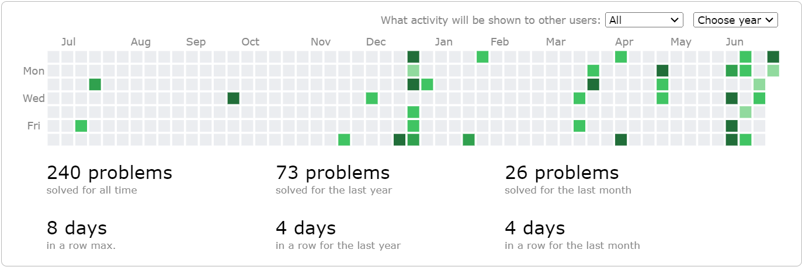

<style>
    @import "../../../slide.css";
</style>

<!-- _class: lead -->

# Introduction to CompProg
## Gabee De Vera

---

<!-- _class: lead -->

# What is CompProg?

---

<!-- _class: top -->

<br>

# What is CompProg?

* A Programming Competition?

---

<!-- _class: top -->

<br>

# What is CompProg?

* A Programming Competition?
* A Mind Challenge?

---

<!-- _class: top -->

<br>

# What is CompProg?

* A Programming Competition?
* A Mind Challenge?
* A Sport?

---

<!-- _class: top -->

<br>

# What is CompProg?

<style scoped>
    li {
        opacity: 0.5;
    }
    li:last-of-type {
        opacity: 1;
    }
</style>
* A Programming Competition?
* A Mind Challenge?
* A Sport?
* A **Community**

---

<!-- _class: lead -->

# Benefits of Being in CompProg

---

<!-- _class: top -->

# Benefits of Being in CompProg

1. You get to practice your **programming and mathematical thinking skills**. :computer:

---

<!-- _class: top -->

# Benefits of Being in CompProg

1. You get to practice your **programming and mathematical thinking skills**. :computer:
2. Doing well in CompProg Competitions, especially in the International Olympiad in Informatics is very helpful for **college applications**. :mortar_board:

---

<!-- _class: top -->

# Benefits of Being in CompProg

1. You get to practice your **programming and mathematical thinking skills**. :computer:
2. Doing well in CompProg Competitions, especially in the International Olympiad in Informatics is very helpful for **college applications**. :mortar_board:
3. You'll have a lot of **fun** solving problems (at least, I hope you're having fun). :smile:

---

<!-- _class: top -->

# Benefits of Being in CompProg

1. You get to practice your **programming and mathematical thinking skills**. :computer:
2. Doing well in CompProg Competitions, especially in the International Olympiad in Informatics is very helpful for **college applications**. :mortar_board:
3. You'll have a lot of **fun** solving problems (at least, I hope you're having fun). :smile:
4. Most importantly: you get to meet **new friends** and **like-minded individuals**. :wave:

---

> ***The true AC is the FRIENDS we made along the way***
\- Some Competitive Programmer, Probably

Note: **AC** stands for *"all clear"* and is used to signify that a problem has been completely solved.

---

<!-- _class: lead -->

# Strategies and the CompProg Mindset

---

<!-- _class: top lead -->

# Strategies and the CompProg Mindset

## Practice, Practice, Practice, Practice, Practice!



Getting good at CompProg entails not solving 1, nor 2, nor 5, nor 10, nor 50 problems, it entails solving **hundreds** of problems and joining **multiple competitions** on, eg., Codeforces.

---

<!-- _class: top lead -->

# Strategies and the CompProg Mindset

## Attack the Subtasks First!

DO NOT make the mistake of going for the full points right away, especially if you're using a **greedy algorithm** (more on this later) or the **problem has many moving parts**.

When in doubt, go for the easy points. It'll be easier for you psychologically knowing you have sure points than worrying about whether or not your **"full point solution"** will pass all test cases.

---

<!-- _class: top lead -->

# Strategies and the CompProg Mindset

## Be Humble + The Constant Improvement Mindset

This is related to the last point on attacking the subtasks first. Yes, you're in Pisay. Yes, you're smart; however, **don't expect to be able to solve all problems you see**. Know your limits and accept when you aren't able to solve a problem.

**CompProg is hard**, and **you will fail**, countless of times. Having some **humility** and **acknowledging your limits** will not only help you retain your peace while doing CompProg, but it will also help you realize where you can improve.

---

<!-- _class: top lead -->

# Strategies and the CompProg Mindset

## Rest


CompProg is not your 24/7 job. Don't let an excess of CompProg affect your **studies**, **family life**, **time with friends**, and, if you're religious, **time with God**.

Take a break (when it's time for one)!

---

<!-- _class: top lead -->

# Strategies and the CompProg Mindset

## Have Fun!

# :smile:

I hope your primary motivator in joining CompProg is that you **find it fun**! That way, even if you may experience setbacks, you'll persevere in CompProg simply because you find it *fun*.

---

<!-- _class: top lead -->

<style scoped>
    li {
        text-align: left;
    }
</style>

# Resources for CompProg

## Getting Started: Readings For CompProg

- [NOI.PH Website](https://noi.ph/)
- [NOI.PH Preparation Guide](https://noi.ph/prepare/)
- [The Competitive Programmer's Handbook](https://cses.fi/book/book.pdf)
- [NOI.PH Learning Guides](noiph-modules/)

---

<!-- _class: top lead -->

<style scoped>
    li {
        text-align: left;
    }
</style>

# Resources for CompProg

## Getting Started: Readings For CompProg

- [Algorithms for CompProg](https://cp-algorithms.com/)
- [WilliamFiset's Videos on CompProg](https://www.youtube.com/@WilliamFiset-videos/playlists)
- [Errichto's Videos on CompProg](https://www.youtube.com/@Errichto/playlists)
- [USACO Guide](https://usaco.guide/)

---

<!-- _class: top lead -->

<style scoped>
    li {
        text-align: left;
    }
</style>

# Resources for CompProg

## GitGud:tm: at CompProg (Practice Problems)


- [Past NOI.PH Problems](https://www.hackerrank.com/contests/noi-ph-practice-page/challenges)
- [Codeforces](https://codeforces.com/)

---

<!-- _class: top lead -->

<style scoped>
    li {
        text-align: left;
    }
</style>

# Resources for CompProg

## GitGud:tm: at CompProg (More Practice Websites)


- [AtCoder](https://atcoder.jp/)
- [Project Euler](https://projecteuler.net/)
- [CodeChef](https://www.codechef.com/)

---

<!-- _class: top lead -->

<style scoped>
    li {
        text-align: left;
    }
</style>

# Resources for CompProg

## GitGud:tm: at CompProg (If You're Gunning for the IOI)

- [oj.uz (For IOI/APIO Problems)](https://oj.uz/)
- [IOI 2024 Syllabus](https://ioinformatics.org/files/ioi-syllabus-2024.pdf)

---

<!-- _class: lead -->

# Are you Overwhelmed?

## Worry not! You are not Alone in your CompProg Journey ^^

---

<!-- _class: lead -->

# Trainer Introduction

---

<!-- _class: lead -->

# Introduce Yourselves!

---

<!-- _class: lead -->

# About Reboot

---

<!-- _class: top -->

# About Reboot

The Reboot CompProg Division is a student-run training program for PSHS-MC students who want to get their feet wet in the world of **informatics competitions**.

What we'll do in Reboot:
1. **Prepare** you for competitions such as Abakoda, TAMa, NOI.PH, and the IOI. :muscle:
2. Equip you with **data structures, algorithms, and mathematical knowledge** to succeed not only in these competitions, but also in your future careers. :brain:
3. Provide a **community** within Pisay where you can discuss and interact with like-minded friends ^^

---

<!-- _class: top -->

# Training Format

We'll have one topic per week with some problems relevant to that topic.

- **Tuesday Afternoon/Evening:** Synchronous meeting (either f2f or online)
- **Friday Afternoon/Evening:** Asynchronous progress updates -- what you accomplished, what you're stuck on (if any), and what you plan to do until the next meeting ~~(yes, this is Scrum, kinda)~~
- **All Other Times:** **Free discussion** of problems with other Reboot members

**Active Participation** is expected! We understand you have requirements and try our best to work around the busy Pisay schedule, but we hope you can dedicate around **4-7 hours per week** to solving problems. *We're always here to help if you need it.*

---

<!-- _class: lead -->

# C++

---

<!-- _class: top -->

# C++

**C++** will be our main language of instruction. For Python users, we will still accept Python, but we **strongly recommend** transitioning to C++. You'll need to use C++ later on once you advance far enough in CompProg, anyways.

C++ is a **compiled language**. This means that the C++ source code is first converted to a machine-readable format before executing. Your general flow in writing a C++ program is:
1. **Write** C++ code
2. **Compile** C++ code
3. **Run** C++ code
4. **Debug** C++ code; repeat steps 1-3 until no bugs are found

---

<!-- _class: top -->

# C++

Here is a C++ **Hello World** program:

```c++
#include <bits/stdc++.h>
using namespace std;

int main() {
    cout << "Hello World!" << endl;
    return 0;
}
```

More details to follow later!

---

<!-- _class: lead -->

# Setting up your Environment
## Windows Subsystem for Linux

---

<!-- _class: top -->

## Windows Subsystem for Linux

*Note: If you're on **Mac** or **Linux**, feel free to skip this part.*

**Windows Subsystem for Linux** (WSL) allows you to run Linux on your Windows machine. WSL comes preinstalled with the **C++ compiler**, so setting up will be a lot easier :tada:

If you're on Windows, I **strongly discourage** you from downloading a C++ compiler directly on your Windows machine. Trust me, it is pain :smiling_face_with_tear:

Refer to [this resource](https://docs.google.com/document/d/1c66WJAY8AHIYInEd3roXMS2LBKf6YrcD7O_9Y-cgU2U/edit#heading=h.q08w3lyhf0wx) *by NOI.PH Trainer Cisco Ortega* for instructions on setting up C++ (and for transitioning from Python to C++ if you're a Python main).

---

<!-- _class: top -->

## Homework for this Week

For *Windows users only*: **Set up WSL on your computer.**

For *Everyone*: **Write, Compile, and Run a Hello World Program in C++.** Feel free to put any other academically appropriate message there ^^

```c++
#include <bits/stdc++.h>
using namespace std;

int main() {
    cout << "It's time to start coding!" << endl;
    return 0;
}
```

---
<!-- _class: lead -->
# Follow your Dreams


---

<!-- _class: top -->

# Images Used
1. https://inspirationfeed.com/wholesome-memes/
2. https://www.etsy.com/listing/1023359285/hollow-knight-hornet-git-gud-sticker
3. https://backiee.com/wallpaper/follow-your-dreams-doge-cheems-meme/241510