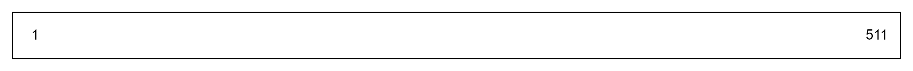
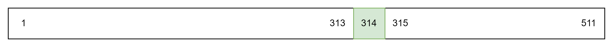
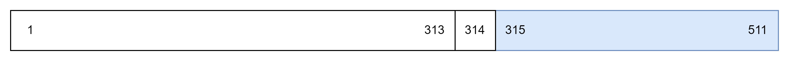
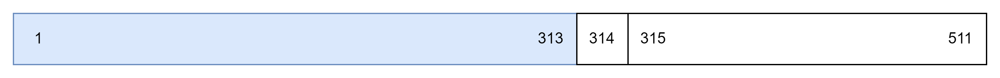
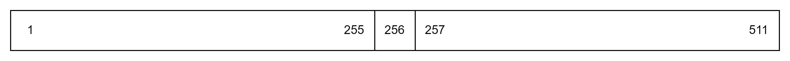
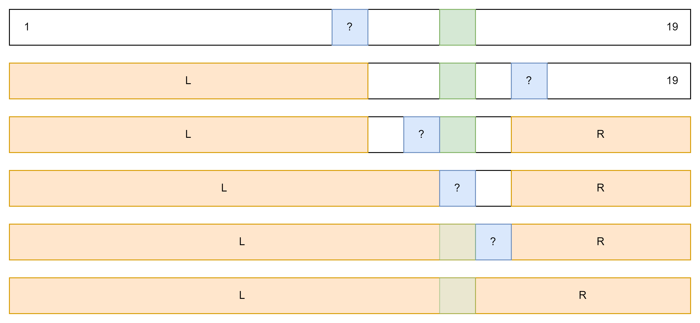

<style>
    @import "../../../slide.css";
</style>

<!-- _class: lead -->

# Binary Search 1
## Bootcamp Track
## Gabee De Vera

---

<!-- _class: lead -->

# Guess the Number!

---

<!-- _class: top -->

# Guess the Number!

- I am thinking of a number from $1$ to $8$, inclusive.
- You can guess a number, then I'll tell you if the number is less than, equal to, or greater than the number you guessed.
- Can you guess the number in $Q = 8$ queries?

---

<!-- _class: top -->

# Guess the Number!

- **Basic lang yan!**
- Guess $q = 1$, then $q = 2$, then $q = 3$, and so on...
- We will need $O(n)$ queries
- This is known as **linear scan**

---

<!-- _class: top -->

# Linear Scan: Implementation

```c++
int maxn;
cin >> n;
int ans;
for(int i = 1; i <= maxn; i++) {
    if(query(i) == "EQU") {
        ans = i;
        break;
    }
}
```

---

<!-- _class: top -->

# Guess the Number!

- But what if we want to *push the bounds higher*:tm:?
- Now, what if I ask you to guess a number between $1$ and $511$. You only have $Q = 8$ queries to find the number.
- Oh noes! What do we do now?

---

<!-- _class: top -->

# Guess the Number!

- Notice something: if you guess, say $q = 314$, and I say *higher*, you now know that the number is in $[315, 511]$ :open_mouth:
- Similarly, if I say *lower*, you now know the number is in $[1, 313]$ :open_mouth:
- In other words, in the worst case, we only have to search $313$ numbers (in case the number is under $314$)
- Therefore, if we **identify the right number to query**, we could effectively **halve the search space!** :O
- A visualization should help!

---

<!-- _class: top -->

# Guess the Number!

- Imagine the search space on a number line like the one below.



---

<!-- _class: top -->

# Guess the Number!

- When we query a number like $q = 314$, one of three things happen. It may happen that $314$ is the correct answer, in which case the algorithm terminates.



---

<!-- _class: top -->

# Guess the Number!

- However, it's also possible that the number we are looking for is higher than $q = 314$, in which case we have to search the interval $[315, 511]$.



---

<!-- _class: top -->

# Guess the Number!

- Finally, it's possible that the number we are looking for is below $q = 314$. This is the worst case since we need to search a larger interval compared to if the number is higher.



---

<!-- _class: top -->

# Guess the Number!

- As you can see from the previous two slides, we might have to deal with an interval of size $\max(q - 1, 511 - q)$ after the query.
- We would ideally want to **minimize the size of the interval** to the left and right of the query point to ensure that the algorithm runs quickly.
- From the diagram below, it's quite clear that, to minimize this quantity, we must **pick the midpoint**.



---

<!-- _class: top -->

# Guess the Number!

- So now, our algorithm is to keep picking the midpoint of the search space. This will halve the search space at each iteration.
- What is the **running time** of the algorithm?
- Well, finding the midpoint can be done in constant time using `(l + r) / 2` or `(l + r) >> 1` (both are equivalent, but the latter is faster)
- Therefore, our algorithm only depends on the number of times we need to divide the search space by 2.

---

<!-- _class: top -->

# Guess the Number!

- Suppose that the maximum number is $N$. Then, we need to determine how many times we need to halve $N$ so that it is less than or equal to 1.
- Halving $N$ $k$ times results in $\frac{N}{2^k}$.
$$\frac{N}{2^k} \le 1$$
$$N \le 2^k$$
$$k \ge \log_{2} \left(N\right)$$

- Thus, $k = O(\log_{2} \left(N\right))$, where $\log_{2}$ is the base-$2$ logarithm of $N$ (see https://www.youtube.com/watch?v=zzu2POfYv0Y if you don't know what this is)

---

<!-- _class: top -->

# Guess the Number!

- Since $k = O(\log_{2} \left(N\right))$, our algorithm runs in $O(\log N)$ :exploding_head:
- (Note: we usually, *not always*, drop the base of logarithms in big $O$ notation)
- For reference, $\log_{2} \left(511\right) \approx 9$, so our algorithm runs fast!
- Even if $N = 1.8 \cdot 10^{19}$, the algorithm can still find the number in $Q = 63$ queries! :exploding_head:

---

<!-- _class: top -->

# Binary Search: Normal Implementation

```c++
int l = 1, r = maxn;
int ans;
while(r - l > 0) {
    int m = (l + r) >> 1;
    string qans = query(m);
    if(qans == "CORRECT") {
        ans = m;
        break;
    } else if(qans == "LOWER") {
        r = m - 1;
    } else if(qans == "HIGHER") {
        l = m + 1;
    }
}
if(l == r) ans = l;
cout << "ANS " << ans << endl;
```

---

<!-- _class: top -->

# Binary Search: Invariant Implementation

- Most binary search implementations make use of `+1` or `-1` in parts of the algorithm. This may increase the risk of writing bugs! :cry:
- There is an *alternative* way of thinking about binary search that simplifies implementation. In fact, we can shorten the previous code to something like this:
```c++
int l = 0, r = maxn + 1;
while(r - l > 1) {
    int m = (l + r) >> 1;
    if(query(m) == "HIGHER") r = m;
    else l = m;
}
cout << "ANS " << l << endl;
```

---

<!-- _class: top -->

# Binary Search: Invariant Implementation

```c++
int l = 0, r = maxn + 1;
while(r - l > 1) {
    int m = (l + r) >> 1;
    if(query(m) == "HIGHER") r = m;
    else l = m;
}
cout << "ANS " << l << endl;
```

- Wait, ***HOW???***
- Allow me to introduce you to the *invariant-based* binary search

---

<!-- _class: top -->

# What is an Invariant?

- An **invariant** is a property that remains true throughout the program
- Invariants appear a lot outside the context of binary search. They may even show up in some CompProg problems, far removed from the context of binary search!
- However, invariants also provide us an alternative way to frame binary search. From the point of view of invariants, binary search is simply an algorithm to update invariants efficiently.
- For example, when we query a number and find that it is lower than or equal to the correct answer, then we *know* for a fact that everything less than that number is *also* less than the correct answer (due to the transitivity of "<").

---

<!-- _class: top -->

# Binary Search: Invariant Implementation

- Thus, we now know that everything $\le l$ is less than or equal to the correct answer, where $l$ is the number we last queried.
- Similarly, if the number is greater than the correct answer, then we know everything $\ge r$ is greater than or equal to the correct answer, where $r$ is the number we last queried.
- We can then *keep track* of two numbers $l$ and $r$, representing the sets $L = [1, l]$ and $R = [r, N]$ (when $l < 1$ or $r > N$, we take $L = \varnothing$ or $R = \varnothing$, respectively). Initially, $l = 0$ and $r = N + 1$. Generally, you must set $l$ and $r$ to be numbers *outside* of your initial range of numbers
- Everything $\le l$ is less than or equal to the correct answer, while everything $\ge r$ is greater than the correct answer. This is our invariant.

---

<!-- _class: top -->

# Binary Search: Invariant Implementation

- Then, at every point in our binary search, we check whether $m = (l + r) / 2$ is part of the left or right set. As a reminder, everything on the left set is less than or equal to the correct answer, while everything on the right set is greater than the correct answer.
- If we find $m \le C$, where $C$ is the correct answer, then we update $l \leftarrow m$. Otherwise, we update $r \leftarrow m$.
- Finally, we terminate when $r - l \le 1$, which is when we have successfully marked every number to either be in $L$ or $R$.

---

<!-- _class: top -->

# Binary Search: Invariant Implementation

```c++
int l = 0, r = maxn + 1;
while(r - l > 1) {
    int m = (l + r) >> 1;
    if(query(m) == "HIGHER") r = m;
    else l = m;
}
cout << "ANS " << l << endl;
```

- The advantage of this approach is that it avoids the off-by-one errors found in the normal implementation of binary search. Note that it may still be beneficial to know both implementations of binary search, but in practice, invariant-based binary search is a lot less error-prone. After I switched to invariant-based binary search, I rarely made mistakes in my binary search implementation.

---

<!-- _class: top -->

# Invariant Binary Search, Visualized

- Invariant-based binary search keeps track of two sets of values $L$ and $R$. Everything in $L$ is less than or equal to the answer, while everything in $R$ is greater than the answer. It then updates these two sets until all points in the interval are in one of the two sets.



---
<!-- _class: top -->

# Binary Searching for an Item in a List

- You are given a list of $n$ numbers. You have to answer $q$ queries: For every query, you are given a number $k$. Is the number $k$ in the list?

---
<!-- _class: top -->

# Binary Searching for an Item in a List

- You are given a list of $n$ numbers. You have to answer $q$ queries: For every query, you are given a number $k$. Is the number $k$ in the list?
- You can solve this using the set data structure, but there's also a way to solve this using binary search! :O
- The idea is to **first sort the list**. In general, sorting the list introduces additional structure to our data. In fact, sorting allows us to define an invariant on the new list!
- Let $L(k)$ be the set of numbers less than or equal to $k$, and $R(k)$ be the set of numbers greater than $k$. Since we've sorted the list, the sets $L(k)$ and $R(k)$ form a prefix and suffix on the list, respectively.

---
<!-- _class: top -->

# Binary Searching for an Item in a List

- We can then use binary search to efficiently determine which set each item in the list belongs in.
- Then, if $k$ is in the list, it must be in the left set $L$ by definition, since $L$ contains all numbers that are less than *or equal* to $k$. Then, all that's left is to check whether the largest element of $L$ is equal to $k$.
- This gives us an $O((n + q) \log n)$ algorithm :partying_face:

---
<!-- _class: top -->

# Binary Searching for an Item in a List

- Here's the implementation. Notice that we avoid off-by-one errors
```c++
int n, q; cin >> n >> q;
vector<int> a(n, 0);
for(int& av : a) cin >> av;     /* Inputting a list of numbers */
sort(a.begin(), a.end());
while(q--) {
    int k; cin >> k;
    int l = -1, r = n;          /* Start of Invariant Binary Search */
    while(r - l > 1) {
        int m = (l + r) >> 1;   /*(n >> 1) == n / 2 but is faster*/
        if(a[m] <= k) l = m;    /* a[m] is in the left set */
        else r = m;             /* a[m] is in the right set */
    }
    cout << (0 <= l && l < n && a[l] == k ? "YES" : "NO") << endl;
}
```

---
<!-- _class: top -->

# Conclusion

- Binary search is a *ubiquitous algorithm* in CompProg. It is a very essential tool to have in your toolbelt.
- We can use the **invariant-based** implementation of binary search to avoid off-by-one errors.

---

<!-- _class: top -->

# Homework

- Check the [Reboot Website](https://redblazerflame.github.io/reboot-materials/compprog-materials/bootcamp/11-binary-search-1/) for your homework this week ^^
- As usual, feel free to ask for help on Discord (either from your fellow trainees or from the trainers). Binary search is not that easy to master, especially if it's your first time doing it. We're always here to help :smile: