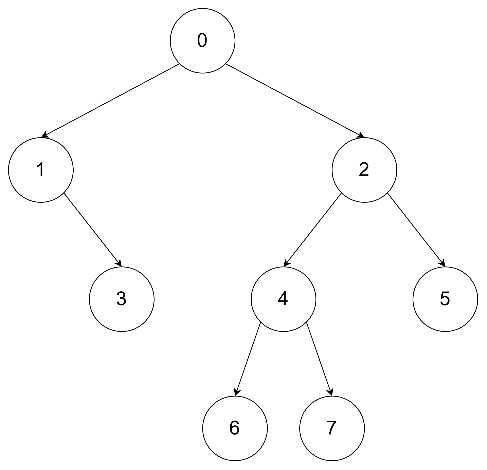
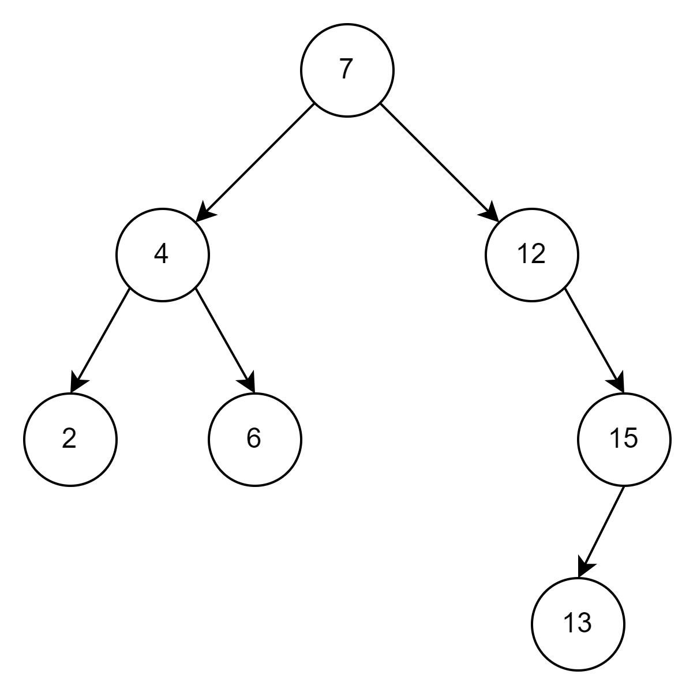
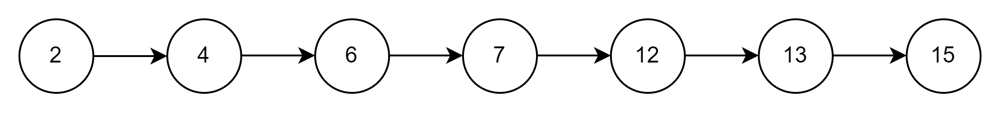
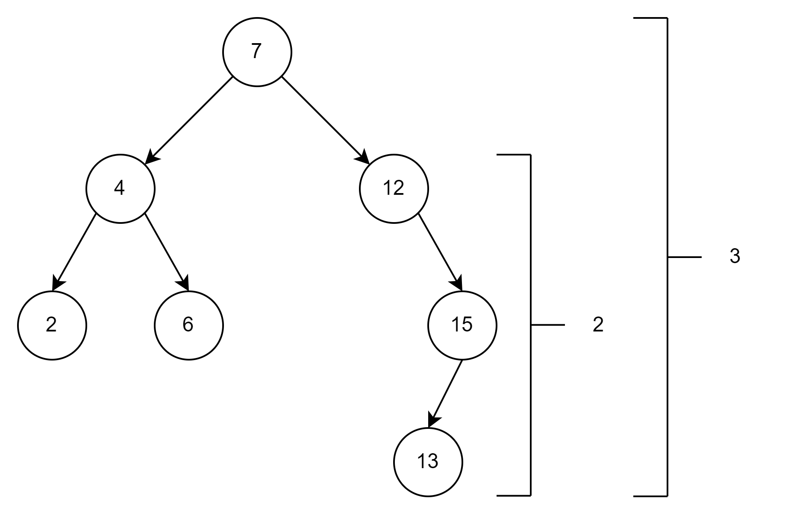
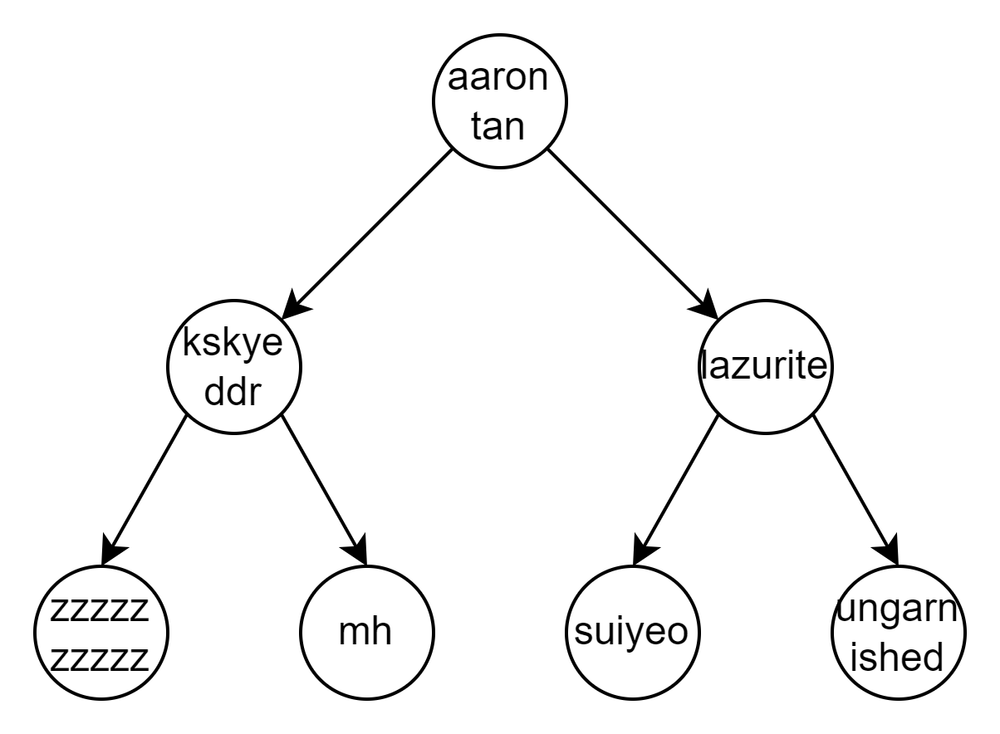
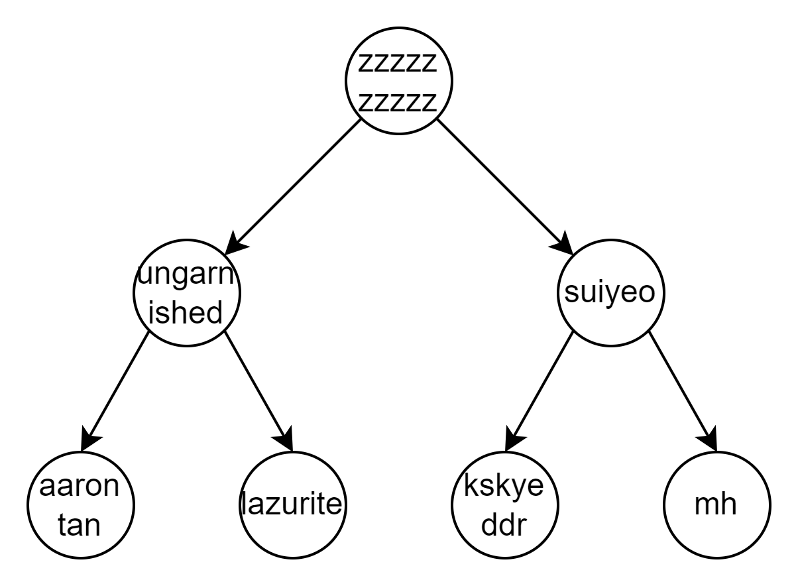

<!-- _class: lead -->

# Trees 1
## Veteran Track
## Gabee De Vera

---

<!-- _class: lead -->

# Trees are Cool!

---

<!-- _class: top lead -->

# By now, you know I'm not talking about these trees

## (Though they are cool! :cherry_blossom:)

---

<!-- _class: top -->

# Recall
- Trees are composed of nodes, each with zero or more children.
- Usually, trees are also **rooted**. There is a node that is on the "top" of the tree (you can think of this node as if it were the common ancestor of a family tree)
- Trees have a **recursive** structure. Each node forms the root of a subtree.

---

<!-- _class: top -->

# Trees are Graphs
- The nodes and edges may also remind you of a similar structure: Graphs. In fact, trees are graphs!
- Specifically, trees are connected, acyclic graphs. The following are equivalent definitions of trees:
    1. Trees are connected graphs with exactly $|V| - 1$ edges.
    1. **Rooted** trees are composed of either nothing, or a node connected to the root(s) of zero or more rooted subtrees.
    1. Trees are those graphs such that there is a unique path from every node to every other node.
    1. Trees are connected graphs such that removing any edge disconnects it.

---

<!-- _class: top -->

# Tree-based/Hierarchical Data Structures
- Some data structures follow the structure of a tree. These are tree-based or **hierarchical** data structures.
- Shown below is the segment tree, one of the most common custom tree data structures used in CompProg. More on these... soon! :smile:

(image from https://cp-algorithms.com/data_structures/segment_tree.html)

---

<!-- _class: top -->

# Implementing Sets
- As an introduction to Hierarchical Data Structures, let us consider the following problem:
- You have a set of integers $S$, initially empty. You are given $Q$ queries of the following type:
    1. Insert $v$ into $S$. In other words, set $S \leftarrow S \cup \left\{v\right\}$.
    1. Determine whether $v$ is in $S$.
    1. Find the smallest integer in $S$ greater than or equal to $v$.
- Your goal is to find an algorithm that runs in $O(Q \log N)$ on average.

---

<!-- _class: top -->

# Implementing Sets
- You may recognize these as operations on the set data type, and in fact, you're right!
- You can use the set data structure in STL, then just use the `count` and `lower_bound` methods to handle the queries (feel free to do this as an exercise)
- However, let's try to implement sets ourselves!

---

<!-- _class: top -->

# Drawing Inspiration from Binary Search
- Let's try to implement the `find` operation. Given a value $v$, we must determine if it's in the set.
- Suppose we were just using a list. If the list were sorted, we could perform binary search by choosing the middle of the list as a pivot, then checking if $v$ is above or below the pivot. Then, we halve the search space and use a different pivot, and so on. This takes $O(\log n)$ time ^^
- However, this only works if we don't need to insert any new values to the set. Is there a way to support both operations efficiently?

---

<!-- _class: top -->

# Drawing Inspiration from Binary Search
- Let's try to implement the `find` operation. Given a value $v$, we must determine if it's in the set.
- Suppose we were just using a list. If the list were sorted, we could perform binary search by choosing the middle of the list as a pivot, then checking if $v$ is above or below the pivot. Then, we halve the search space and use a different pivot, and so on. This takes $O(\log n)$ time ^^
- However, this only works if we don't need to insert any new values to the set. Is there a way to support both operations efficiently?
- It turns out there is! The idea is to maintain a **tree** data structure. Each node contains a value. Then, the left subtree contains all the values that are less than or equal to it, while the right subtree contains all values that are greater than it.

---

<!-- _class: top -->

# Binary Search Trees

- This data structure is known as a **Binary Search Tree** (BST)

---

<!-- _class: top -->

# The BST Invariant
- Another way to think about BSTs is that each node satisfies the **BST invariant**:
    1. At every point in time, everything in the left subtree of a node has a smaller value, while everything in the right subtree of a node has a greater value.
- Changing the invariant also changes the data structure!
- This invariant-based intuition of hierarchical data structures will become quite useful, especially when we delve into Segment Trees. Make sure to remember it! :eyes:

---

<!-- _class: top -->

# BST Exercises

- Where would the number "1" be inserted?
---

<!-- _class: top -->

# BST Exercises

- Where would the number $1$ be inserted? **To the left of the node containing 2**

---

<!-- _class: top -->

# BST Exercises

- Where would the number $10$ be inserted?
---

<!-- _class: top -->

# BST Exercises

- Where would the number $10$ be inserted? **To the left of the node containing 12**

---

<!-- _class: top -->

# BST Exercises

- Where would the number $10^{10^{100}}$ be inserted?

---

<!-- _class: top -->

# BST Exercises

- Where would the number $10^{10^{100}}$ be inserted? **To the right of the node containing 15**

---

<!-- _class: top -->

# BST Implementation

- Let us now implement a BST in code!
- Due to the recursive nature of trees, it suffices to keep a reference to the root node!
- Again, we can think of a BST as a root node with left and right subtrees (which themselves are also BSTs)
- So now, our representation of BSTs involves a `node` that references or *points* to two nodes: one to the left and another to the right.
- The implementation is quite long. You can find the implementation here: https://github.com/RedBlazerFlame/reboot-materials/tree/main/compprog-materials/veteran/14-trees/solutions/bst.cpp

---

<!-- _class: top -->

# Disadvantages of a Normal BST
- While the BST does achieve $O(\log n)$ time on average per query, in the worst-case, the performance may degrade to $O(n)$ per query.
- For instance, consider what happens when you insert values in increasing order. You'll end up with a degenerate line tree!
- When this happens, lookup operations slow down, since you're essentially linearly searching over a linked list.

---

<!-- _class: top -->

# Changing the Invariant
- The solution to this is to **modify the invariant**. Instead of simply ensuring that everything to the left of a node is less than or equal to it and everything to the right of a node is greater than it, we must impose another constraint:
    - For each node, the difference in **heights** of the left and right subtree must be at most $1$.
- Here, we define the height of a subtree to be the maximum distance of any node from the root.

---

<!-- _class: top -->

# Height of a Subtree

---

<!-- _class: top -->

# Changing the Invariant

- When the height difference between the two subtrees is at most one, we say that the tree is **height-balanced**.
- It turns out that if the BST satisfies the height invariant, find and lower bound queries take $O(\log n)$ time *in the worst-case*.
- We can modify our implementation of the BST to ensure that, whenever we insert a new node, the nodes rearrange themselves to ensure that the BST follows both the BST and height invariant. This rearrangement is known as **rebalancing**.
- A BST that automatically rebalances upon inserting a new node is known as a **self-balancing BST**. There are many implementations of self-balancing BSTs, such as Red-Black Trees and AVL Trees, but we won't discuss these in this lecture ^^

---

<!-- _class: top lead -->

# Lesson

 
 
 

## Changing the Invariant Changes the Data Structure and its Underlying Time Complexity

---

<!-- _class: top -->

# Other Invariants

- Suppose that we replace the BST invariant with the following: For every subtree, the root node has the smallest value.
- This is a data structure known as a *min-heap*, or simply a *heap*. Heaps can be used to implement priority queues, since it allows for quick access to the minimum element.

---

<!-- _class: top -->

# Other Invariants
- The following is a min-heap that uses alphabetical ordering to order the nodes:

---

<!-- _class: top -->

# Other Invariants
- A **max-heap** instead ensures that the top node is maximal:

---

<!-- _class: top -->

# Other Invariants

- Let's change the invariant once again!
- Now, we want to ensure that the value at every node is the sum of the values of its children. If the node has no children, its value can be anything.
- We also want to ensure that each node has exactly zero or two child nodes (you can't have a node with a single child).
- Finally, we want each node to store an *interval* $I = [l, r]$. Then, the interval at each node must either be a single point (as in the case of $[2, 2]$) or be equal to the union of the intervals of its children.
- What data structure do we get now?

---

<!-- _class: top -->

# Other Invariants

- It turns out that these sets of invariants give us a Range Sum Segment Tree!
- Each node represents the sum of all values over a range :exploding_head:

(image from https://cp-algorithms.com/data_structures/segment_tree.html)

---

<!-- _class: top lead -->

# Next Week

 
 
 

## IT'S SEGTREE TIME!!!
(I hope you're excited ^^)

---

<!-- _class: top -->

# Homework

- Check the [Reboot Website](https://redblazerflame.github.io/reboot-materials/compprog-materials/veteran/14-trees/) for the homework this week. It might be hard to implement hierarchical data structures at first, so feel free to **collaborate and discuss with your fellow trainees**. You may also **ask for help from the trainers** and even **read the editorial (but only when you're really stuck)** :smile:

---

<!-- _class: top -->

# Images Used

1. Agreda, P. (2018, April 13). *Flowering Trees* \[Image\]. Pexels. https://www.pexels.com/photo/flowering-trees-1005168/
1. *Segment Tree*. (2023, December 20). CP-Algorithms. https://cp-algorithms.com/data_structures/segment_tree.html