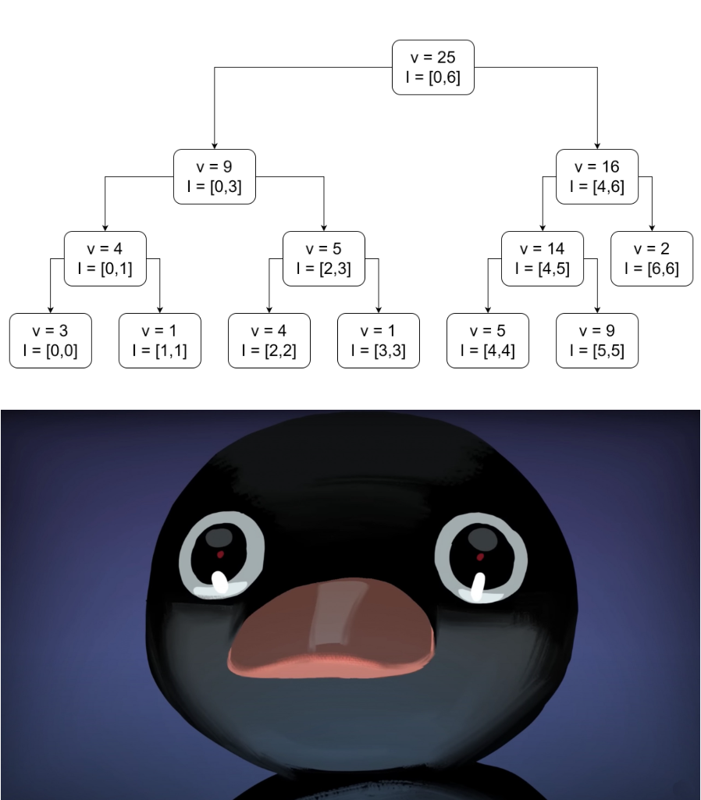
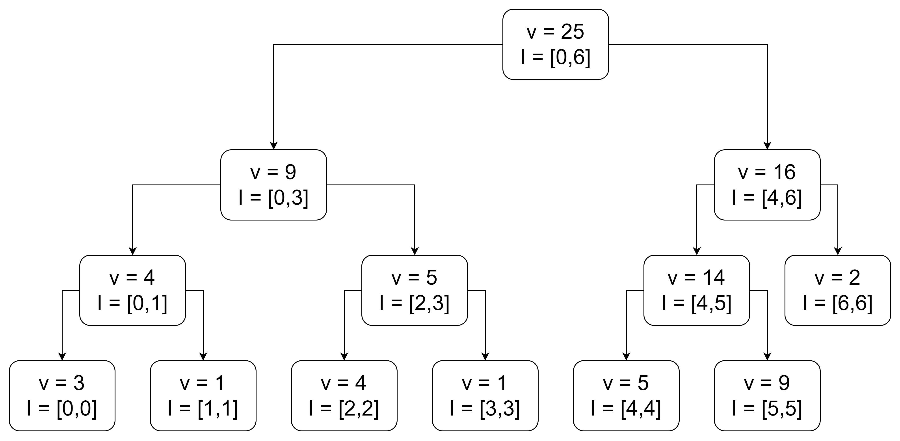
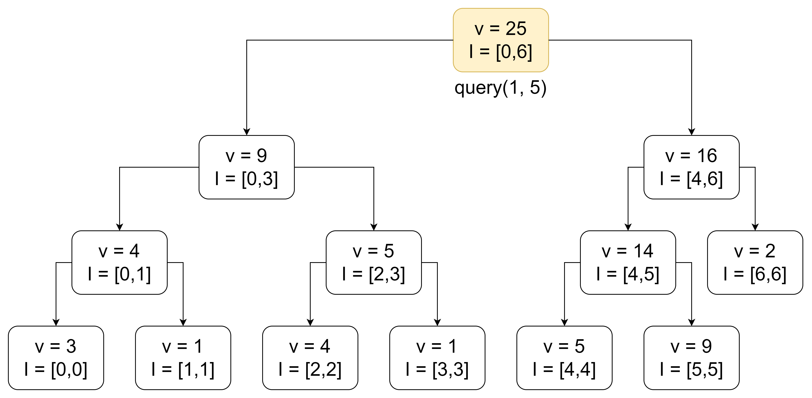
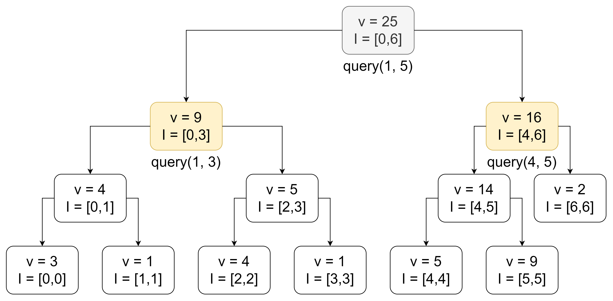
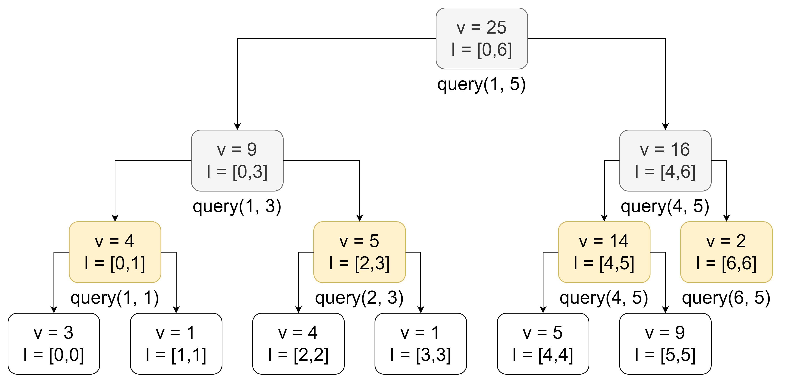
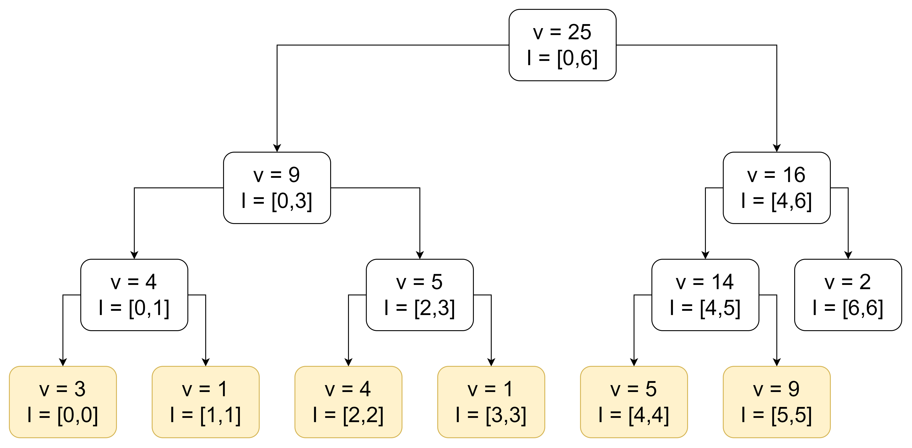
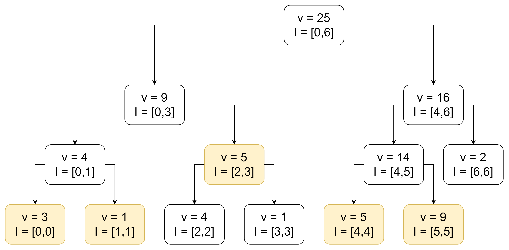
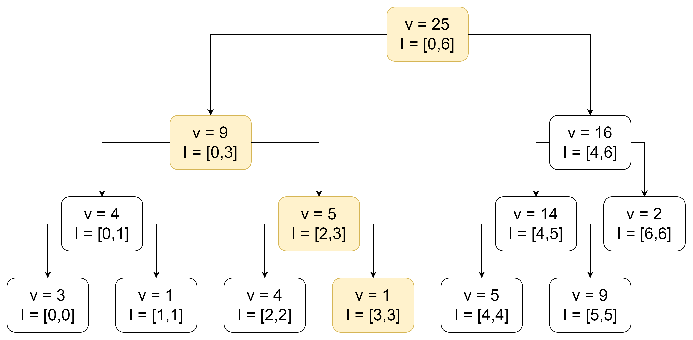
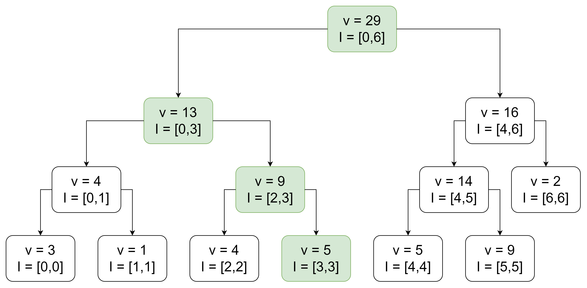

<!-- _class: lead -->

# Segment Trees 1
## Veteran Track
## ~~Adik "ProtonDecay314" sa Segtree~~

---

<!-- _class: lead -->

# Segment Trees 1
## Veteran Track
## Gabee De Vera

---

<!-- _class: lead -->

# Well, Are you Ready Kids???

---

<!-- _class: lead -->

# Since You're in the Veteran Track... it's time to up the game

---

<!-- _class: top lead -->

# SEGMENT TREES

---

<!-- _class: lead -->

# But Why Use Segment Trees?

---

<!-- _class: top -->

# Motivating Problem
- Let's try to solve the following problem:
- You are given a list $a$ of $N$ integers. Then, you are given $Q$ queries. For each query, you need to find the sum of all numbers in the range $[l, r]$ of $a$, where $l$ and $r$ are integers given per query.

---

<!-- _class: top -->

# Motivating Problem
- Let's try to solve the following problem:
- You are given a list $a$ of $N$ integers. Then, you are given $Q$ queries. For each query, you need to find the sum of all numbers in the range $[l, r]$ of $a$, where $l$ and $r$ are integers given per query.
- Each query is known as a **range query**, since we query the sum over a range.
- This is quite easy to solve: simply store a list $\sum a$ of prefix sums. Then, $\left(\sum a\right)[i] := \sum_{j = 0}^{i - 1} a[j]$. This could be done in $O(N)$.
- Finally, to compute the range sum, you simply need to compute $\left(\sum a\right)[r + 1] - \left(\sum a\right)[l]$, which takes $O(1)$ time.
- So our overall time complexity is $O(N + Q)$, which is asymptotically optimal! :D

---

<!-- _class: top -->

# Point Updates
- But what if the values in the array $a$ change over time?
- Specifically, what if, aside from computing the sum of all values over a range $[l, r]$, we also need to set the value of $a[i]$ to a new integer $v$?
- This is known as a **point update**, since we update the value at a single point.
- In the worst-case, we will have to update $N$ prefixes (since $a[0]$ is part of all prefixes). This is bad, since now our program takes $O(QN)$ time, which is no better than simply brute forcing through the list to obtain the sum :cry:
- What do we do?

---

<!-- _class: top -->

# What Went Wrong?
- Well, let's first analyze what went wrong with the prefix sum approach.
- In the prefix sum approach, we stored the sum of the values over *different intervals* (specifically, we stored the sums on the prefixes).
- The issue with the prefix sum approach is that the *prefixes overlapped a lot* (especially for $a[0]$, since all prefixes overlap at $a[0]$). Because of that, we had to update the sum at many different prefixes.
- If we could somehow **reduce the "overlap"** between the different intervals, we would reduce the amount of work needed to update a single value.

---

<!-- _class: top -->

# Borrowing Ideas from Binary Search
- We again borrow ideas from binary search.
- Suppose we want to efficiently handle range queries over the list $[3, 1, 4, 1, 5, 9, 2]$.
- Let's **store a tree of intervals**. Each node of the tree **stores an interval**, as well as **the sum of all values over that interval**.
- Specifically, a node whose interval is $I = [l, r]$ stores the sum $v = \sum_{i = l}^{r} a[i]$.
- Each node also stores a pointer to a *left* and *right* node, each representing the left and right halves of the interval.
- Such a data structure is known as a **segment tree**.

---

<!-- _class: top -->

# Segment Tree

---

<!-- _class: top -->

# Segment Tree: Range Query
- Now, say we want to get the sum over the interval $[1, 5]$
- Let us call $[1, 5]$ the **query interval**. Similarly, let us call the endpoints of the interval **query left** ($q_l$) and **query right** ($q_r$). Here, $q_l = 1$ and $q_r = 5$.
- Then, to answer this range query, we start at the topmost node and recurse downwards to the children.

---

<!-- _class: top -->

# Segment Tree: Range Query

- Let $I = [l, r]$ be the **node interval**. We have some cases to handle:
    1. If the query interval is equal to the node interval (i.e., $l = q_l$ and $r = q_r$), then we simply return the value at the node.
    1. If the query interval does not intersect with the node interval, return $0$. Here, we return $0$ since it is the additive identity (i.e., the number that does not affect the result of addition).
    1. Otherwise, the query interval partially intersects with the node interval. In that case, we recurse over the node's children. It is important to **clip** the query interval so that it is contained within the node interval of the child node before recursing. We'll see why this is important in a bit.

---

<!-- _class: top -->

# Segment Tree: Range Query

---

<!-- _class: top -->

# Segment Tree: Range Query

---

<!-- _class: top -->

# Segment Tree: Range Query

---

<!-- _class: top -->

# Segment Tree: Range Query

---

<!-- _class: top -->

# Segment Tree: Range Query
- What is the time complexity of a range query?
- Well, first and foremost, notice that, for each layer of the segment tree, we only ever query at most **four nodes**! Why?
- Well, suppose that we query more than four nodes in a single layer (like below)

---

<!-- _class: top -->

# Segment Tree: Range Query
- Notice that the query interval can only partially intersect with the leftmost and rightmost nodes in a layer (since the query interval forms a continuous subsegment of the array).
- That means that all nodes in between fully intersect with the query interval. However, that means that their *parent* node also fully contains the query interval.

---

<!-- _class: top -->

# Segment Tree: Range Query

- We have arrived at a contradiction. Therefore, at every layer of the segment tree, we only query at most 4 (i.e., $O(1)$) nodes.
- However, since at every layer of the segment tree, we halve the size of the interval, there are only $O(\log n)$ layers. Therefore, the time complexity of a range query is $O(\log n)$.

---

<!-- _class: top -->

# Segment Tree: Point Updates
- Now, what about point updates? It turns out that this is a lot simpler!
- For example, let's say that we want to update index $3$ to $5$. We simply traverse the tree, going towards the segment that contains index $3$. Then, once we reach the segment containing $[3,3]$, we update it with the new value and propagate the changes up the tree.
- Traversing a segment tree is similar to traversing a binary search tree :smile:

---

<!-- _class: top -->

# Segment Tree: Point Updates

---

<!-- _class: top -->

# Segment Tree: Point Updates

---

<!-- _class: top -->

# Segment Tree: Point Updates

- What is the time complexity of a point update?
- Since we only ever update the nodes that are on the path between the root and the leaf node containing the index we are updating, we only update one node per layer. Thus, point updates take $O(\log N)$ time as well!

---

<!-- _class: top -->

# Segment Tree: Memory Requirements
- Finally, the space complexity of a segment tree turns out to also be $O(N)$.
- That's because at the first layer, there is $1$ node. Then at the second layer, there are at most $2$ nodes. Then at the third layer, there are at most $4$ nodes, and so on, until the $k$th layer, where there are $2^{k - 1} \approx N$ nodes.
- In total, there are $2^k - 1 \le 2N$ nodes in total, so the space complexity of the segment tree is just $O(N)$!

---

<!-- _class: top -->

# The Power of the Segment Tree
- Combining what we have so far, segment trees achieve a time complexity of $O(N + Q \log N)$.
- While slightly slower and more complicated than the prefix sum technique, segment trees manage to also support *point updates*!
- In fact, we will see in future lessons that segment trees can do *so much more* than just perform range sum queries and point updates!

---

<!-- _class: top -->

# Range Sum Segment Tree Implementation
- The implementation of a segment tree is quite long. Check the GitHub for the implementation: https://github.com/RedBlazerFlame/reboot-materials/tree/main/compprog-materials/veteran/15-segment-trees-1/solutions/sumsegtree.cpp

---

<!-- _class: top lead -->

# Lesson

 
 
 
 

## Segtrees are OP

---

<!-- _class: top -->

# Range Maximum Query
- What if, instead of querying the sum over a segment, we want to query the *maximum* instead?

---

<!-- _class: top -->

# Range Maximum Query
- What if, instead of querying the sum over a segment, we want to query the *maximum* instead?
- This turns out to be quite a simple update to our segment tree implementation!
- All we need to do is to instead store the maximum over the interval for each node.
- Then, when a query interval does not intersect with a node interval, we return the *identity of the maximum operation* instead of $0$, which is $-\infty$. Note that taking the max of a number $v$ with $-\infty$ returns $v$, so $-\infty$ indeed acts as an identity element.

---

<!-- _class: top -->

# Range Max Segment Tree Implementation
- The implementation of a segment tree is quite long. Check the GitHub for the implementation: https://github.com/RedBlazerFlame/reboot-materials/tree/main/compprog-materials/veteran/15-segment-trees-1/solutions/maxsegtree.cpp

---

<!-- _class: lead -->

# Congratulations, You can Now Make a Segment Tree! :fire:

---

<!-- _class: top lead -->

# Congratulations, You can Now Make a Segment Tree! :fire:

---

<!-- _class: top -->

# Homework

- Check the [Reboot Website](https://redblazerflame.github.io/reboot-materials/compprog-materials/veteran/15-segment-trees-1/) for the homework this week. Segment trees are advanced black magic reserved for the true masters of the CompProg art (/hj lol anyone can learn it), and it requires practice to learn to wield its power (okay this is actually true ^^). Thus, feel free to **collaborate and discuss with your fellow trainees**. You may also **ask for help from the trainers** and even **read the editorial (but only when you're really stuck)** :smile:

---

<!-- _class: top -->

# Images Used

1. wheresgav. (2023, January 25). *Super Saiyan* [GIF]. Tenor. https://tenor.com/view/nft-shellz-shellz-orb-gif-27456375
1. *Terrified Noot Noot*. (n.d.). imgflip. https://imgflip.com/memegenerator/423779730/Terrified-Noot-Noot