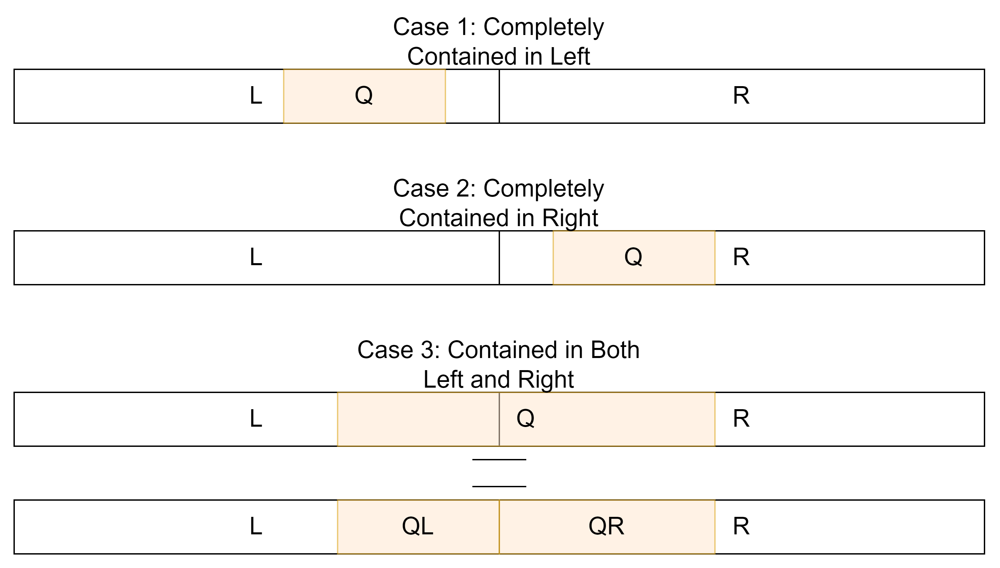

<!-- _class: lead -->

# Segment Trees 2
## Veteran Track
## Gabee De Vera

---
<!-- _class: top lead -->

# Last Week

---
<!-- _class: top -->
# Review: The Basic Segtree Recipe

- What do you need to make a segtree work?
1. The **node state**, which contains the information necessary to answer a query.
1. A **combiner function** that updates the state of a node based on a combination of the states of its children.
1. An **update function** that traverses the segment tree, updates one of the leaf nodes, and propagates the changes up the tree.
1. A **query function** that computes the sum over a query range by combining the aggregate values over different ranges.

---
<!-- _class: lead -->

# Segtrees are POWERFUL

---
<!-- _class: top -->

# Segtrees are POWERFUL
- Segtrees, in their basic form, can handle range sum and range maximum queries.
- In general, segtrees can handle any *associative binary operation*.
- Addition is one of them, since $(a + b) + c = a + (b + c)$
- However, we can also do multiplication, matrix multiplication, vector addition, and even other more "abstract" operations such as rotations and reflections on a square :exploding_head:
- Let's see what other kinds of queries segtrees can handle! :eyes:

---
<!-- _class: top -->

# Counting The Number of Zeros in an Interval

- What if we want to count the number of times zero appears in an interval?
- As usual, we want to be able to update values in the segment tree and query ranges.

---
<!-- _class: top -->

# Counting The Number of Zeros in an Interval

- What if we want to count the number of times zero appears in an interval?
- As usual, we want to be able to update values in the segment tree and query ranges.
- To support these operations, you can **store $1$ in a leaf node if the value at that index is $0$, and store $0$ otherwise**.
- Then, to count the number of zeros, we simply compute the sum over a range.

---
<!-- _class: top -->

# Counting the Number of Times the Maximum is Obtained
- What if we want to not only know what the maximum value over a range is, but also know how many times it occurs? Again, we want to also support point updates.

---
<!-- _class: top -->

# Counting the Number of Times the Maximum is Obtained
- What if we want to not only know what the maximum value over a range is, but also know how many times it occurs? Again, we want to also support point updates.
- This time, we store *both the maximum value and the number of times it occurs*. Let us represent this as $\left\langle m, c\right\rangle$, where $m$ is the maximum value and $c$ is the number of times $m$ occurs.
- Of course, to make this work, we need a **combiner function**. In other words, given the maximum value and the number of times it occurs over two adjacent intervals, we must determine the maximum value and the number of times it occurs over the union of these two intervals.

---
<!-- _class: top -->

# Counting the Number of Times the Maximum is Obtained
- Let $m_l$ and $m_r$ be the maximum values over the left and right subintervals, respectively. Similarly, let $c_l$ and $c_r$ be the number of times these occur.
1. If $m_l > m_r$, then the maximum value over the entire interval is $m_l$, and it occurs $c_l$ times.
1. If $m_l < m_r$, then the maximum value over the entire interval is $m_r$, and it occurs $c_r$ times.
1. Finally, if $m_l = m_r$, then the maximum value over the entire interval is $m_l$ (or $m_r$, it doesn't matter), and it occurs $c_l + c_r$ times.

---
<!-- _class: top -->

# Counting the Number of Times the Maximum is Obtained
- The implementation is quite long. See the GitHub for the implementation: https://github.com/RedBlazerFlame/reboot-materials/tree/main/compprog-materials/veteran/16-segment-trees-2/solutions/max-count.cpp

---
<!-- _class: top -->

# Finding the $k$th Zero
- Say we now want to find the $k$th zero in a segment.
- For instance, in the $0$-indexed array $[1, 9, 0, 8, 0, 0, 3, 0, 5]$, the $3$rd zero is at index $5$.

---
<!-- _class: top -->

# Finding the $k$th Zero
- Say we now want to find the $k$th zero in a segment.
- For instance, in the $0$-indexed array $[1, 9, 0, 8, 0, 0, 3, 0, 5]$, the $3$rd zero is at index $5$.
- It turns out that we can use a previous technique to solve this. If we *count* the number of zeroes in an interval, we can perform binary search on a prefix of the query interval.
- The $k$th zero can be found at the end of the smallest prefix containing exactly $k$ zeroes.
- By doing binary search, we can find this prefix in $O(\log^2 n)$ per query, since we gain a log factor from both the segment tree and the binary search.

---
<!-- _class: top -->

# Finding the $k$th Zero
- It turns out that we can improve the $O(\log^2 n)$ time complexity to $O(\log n)$. The idea is to **perform the binary search directly on the tree**.
- This is known as **walking on the (segment) tree**.
- Implementation-wise, we simply define a function `kth_zero(ql, qr, k)`. Then, we attempt to find the kth zero. We return two values from the function: the number of zeroes found in total over the interval and the index of the $k$th zero.
- The purpose of also returning the number of zeroes found in the interval is to determine whether the $k$th zero is found in the interval or not. This is needed when we try to search over multiple intervals.

---
<!-- _class: top -->

# Finding the $k$th Zero
- The implementation is quite long. See the GitHub for the implementation: https://github.com/RedBlazerFlame/reboot-materials/tree/main/compprog-materials/veteran/16-segment-trees-2/solutions/kth-zero.cpp

---
<!-- _class: top -->

# Dynamic Maximum Subarray Sum
- Given a list of numbers $a$, find the maximum subarray sum over an interval $[l, r]$.
- Specifically, for $l \le l' \le r' \le r$, find $\max \sum_{i = l'}^{r'} a[i]$.
- You also need to handle point updates.

---
<!-- _class: top -->

# Dynamic Maximum Subarray Sum
- Before we solve the dynamic version, note that there is an $O(n)$ greedy solution to the static version. Look up *Kadane's Algorithm* if you're curious.
- However, since we're going to implement a segment tree solution to this problem, we will instead investigate an $O(n \log n)$ divide-and-conquer solution to this problem.

---
<!-- _class: top -->

# Static Maximum Subarray Sum: Divide-and-Conquer
- What if we try to **divide** the interval into two?
- Then, the subarray with maximal sum is either completely contained in the left subinterval or the right subinterval.
- Alternatively, half of the subarray might be contained in the left subinterval while the other half is contained in the right subinterval.

---
<!-- _class: top -->

# Static Maximum Subarray Sum: Divide-and-Conquer

- Notice that, in case 3, we can split the subarray into a suffix over the left subinterval and a prefix over the right subinterval.

---
<!-- _class: top -->

# Static Maximum Subarray Sum: Divide-and-Conquer
- To handle case 3, we must also know the *maximum prefix and suffix sum* over each interval. Fortunately, this is quite easy to compute, since the maximum prefix could either contain or not contain the left subinterval.
- This gives us an $O(n \log n)$ divide and conquer algorithm to find the maximum subarray sum over a static array.

---
<!-- _class: top -->
# Dynamic Maximum Subarray Sum
- To extend this to handle point updates, we simply simulate the divide-and-conquer algorithm on a segment tree.
- Specifically, for each interval, we will store:
    1. the maximum subarray sum,
    1. the maximum prefix sum,
    1. the maximum suffix sum, and
    1. the sum of all values in that interval.

---
<!-- _class: top -->
# Dynamic Maximum Subarray Sum
- Then, the maximum prefix sum over an interval is either the maximum prefix sum over the left subinterval, or the maximum prefix sum over the right subinterval *plus* the sum of all the values in the left subinterval.
- The maximum suffix sum could be computed in a similar fashion as the maximum prefix sum.
- Finally, the maximum subarray sum is either the maximum subarray sum in the left subinterval or the right subinterval, or it is the sum of the maximum suffix sum over the left subinterval and the maximum prefix sum over the right subinterval.
- Using this, we can construct the segment tree.

---
<!-- _class: top -->
# Dynamic Maximum Subarray Sum
- To answer a range query, we do something similar to constructing the segment tree.
- At each step, we compute the maximum subarray sum, the maximum prefix sum, the maximum suffix sum, and the sum over the whole subarray.

---
<!-- _class: top -->
# Dynamic Maximum Subarray Sum: Implementation
- The implementation of the maximum subarray sum segment tree is quite long. Check the GitHub for the implementation: https://github.com/RedBlazerFlame/reboot-materials/tree/main/compprog-materials/veteran/16-segment-trees-2/solutions/max-subarray-sum.cpp

---

<!-- _class: top -->

# Homework

- Check the [Reboot Website](https://redblazerflame.github.io/reboot-materials/compprog-materials/veteran/15-segment-trees-1/) for the homework this week. Segment trees are advanced black magic reserved for the true masters of the CompProg art (/hj lol anyone can learn it), and it requires practice to learn to wield its power (okay this is actually true ^^). The techniques used this week are even more obscure and difficult to master. Thus, feel free to **collaborate and discuss with your fellow trainees**. You may also **ask for help from the trainers** and even **read the editorial (but only when you're really stuck)** :smile:

---

<!-- _class: top -->

# Images Used

1. wheresgav. (2023, January 25). *Super Saiyan* [GIF]. Tenor. https://tenor.com/view/nft-shellz-shellz-orb-gif-27456375