

<!-- _class: lead -->

# Want to Buff your Segtree?

---
<!-- _class: lead -->

# Now you Can!

---
<!-- _class: lead -->

# Introducing...

---
<!-- _class: lead -->

# Lazy Propagation 1
## Veteran Track
## Gabee De Vera

---
<!-- _class: top -->

# Recall
- So far, we know how to implement a segtree that supports (in $O(\log n)$):
    1. **Range** queries, and
    1. **Point** updates

---
<!-- _class: top -->

# Recall
- So far, we know how to implement a segtree that supports (in $O(\log n)$):
    1. **Range** queries, and
    1. **Point** updates

- Recall that, when we say *point* update, we are referring to updating a *single* position in a segment tree.

---
<!-- _class: top -->

# Recall
- So far, we know how to implement a segtree that supports (in $O(\log n)$):
    1. **Range** queries, and
    1. **Point** updates

- Recall that, when we say *point* update, we are referring to updating a *single* position in a segment tree.
- A natural next question to ask is... can we handle both **Range Queries and Range Updates**?

---
<!-- _class: top -->

# What is a Range Update?
- A **Range Update** is an update over an *entire interval*.
- For example, given the (0-indexed) list $[3, 1, 4, 1, 5, 9, 2]$, increasing all elements from index $l = 1$ to index $r = 3$ by $2$ gives: $[3, 3, 6, 3, 5, 9, 2]$.
- This is an example of a *range increment*.
- Our goal today is to make a Range Updating and Range Querying (RURQ) Segment Tree.

---
<!-- _class: top -->

# PURQ $\rightarrow$ RUPQ

- Before tackling range queries and range updates, what if we try to tackle *point* queries and range updates first?
- The trick to handling these types of queries is to *somehow reduce it to range updates and point queries (RUPQ)* (which we can handle using a regular segtree)

---
<!-- _class: top -->

# PURQ $\rightarrow$ RUPQ

- Before tackling range queries and range updates, what if we try to tackle *point* queries and range updates first?
- The trick to handling these types of queries is to *somehow reduce it to range updates and point queries (RUPQ)* (which we can handle using a regular segtree)
- Let us consider a basic example: range increments and point queries

---
<!-- _class: top -->

# PURQ $\rightarrow$ RUPQ
- A range increment refers to adding a fixed value over a subinterval and querying for the value at a point.
- For example, say we have the array $a = [3, 1, 4, 1, 5, 9, 2]$.
- Then, let's say we increase the interval $l = 1$ to $r = 5$ by 2. The new array would be $a' = [3, 3, 5, 3, 7, 11, 2]$.
- Now, consider the array containing the differences between successive elements.
- Formally, let $\Delta l$ refer to the array that satisfies $\Delta l[i] = l[i] - l[i - 1]$ (assume $l[-1] = 0$) for all indices $i$.

---
<!-- _class: top -->

# PURQ $\rightarrow$ RUPQ
- Now, consider again the original array $a = [3, 1, 4, 1, 5, 9, 2]$ and the new array $a' = [3, 3, 5, 3, 7, 11, 2]$. What do $\Delta a$ and $\Delta a'$ look like?

---
<!-- _class: top -->

# PURQ $\rightarrow$ RUPQ
- Now, consider again the original array $a = [3, 1, 4, 1, 5, 9, 2]$ and the new array $a' = [3, 3, 5, 3, 7, 11, 2]$. What do $\Delta a$ and $\Delta a'$ look like?

$$\Delta a = [3, -2, 3, -3, 4, 4, -7]$$
$$\Delta a = [3, 0, 3, -3, 4, 4, -9]$$

---
<!-- _class: top -->

# PURQ $\rightarrow$ RUPQ
- Notice anything interesting with these two arrays?

$$\Delta a = [3, -2, 3, -3, 4, 4, -7]$$
$$\Delta a = [3, 0, 3, -3, 4, 4, -9]$$

---
<!-- _class: top -->

# PURQ $\rightarrow$ RUPQ
- Notice anything interesting with these two arrays?

$$\Delta a = [3, \color{red}-2\color{black}, 3, -3, 4, 4, \color{red}-7\color{black}]$$
$$\Delta a = [3, \color{red}0\color{black}, 3, -3, 4, 4, \color{red}-9\color{black}]$$

- Yep! They differ at at most *two* points!
- Therefore, a *range* increment over $a$ corresponds to *point* updates on $\Delta a$ :exploding_head:

---
<!-- _class: top -->

# PURQ $\rightarrow$ RUPQ
- Now, how do we handle *point* queries? Well, this turns out to be quite simple!
- Again, recall that $\Delta a[i] = a[i] - a[i - 1]$. Consider the following sum:

$$\sum_{k = 0}^{k = i} \Delta a[k]$$

---
<!-- _class: top -->

# PURQ $\rightarrow$ RUPQ
- Now, how do we handle *point* queries? Well, this turns out to be quite simple!
- Again, recall that $\Delta a[i] = a[i] - a[i - 1]$. Consider the following sum:

$$\sum_{k = 0}^{k = i} \Delta a[k]$$

---
<!-- _class: top -->

# PURQ $\rightarrow$ RUPQ

- This simplifies to:

$$\begin{align}\sum_{k = 0}^{k = i} \Delta a[k] & = \sum_{k = 0}^{k = i}a[k] - a[k - 1]\\ 
& = \sum_{k = 0}^{k = i}a[k] - \sum_{k = 0}^{k = i}a[k - 1]\\ 
& = \sum_{k = 0}^{k = i}a[k] - \sum_{k = -1}^{k = i - 1}a[k]\\ 
& = a[i] - a[-1] + \sum_{k = 0}^{k = i - 1}a[k] - \sum_{k = 0}^{k = i - 1}a[k]\\ \end{align}$$

---
<!-- _class: top -->

# PURQ $\rightarrow$ RUPQ

- This simplifies to:

$$\begin{align}\sum_{k = 0}^{k = i} \Delta a[k] & = a[i] - a[-1] + \sum_{k = 0}^{k = i - 1}a[k] - \sum_{k = 0}^{k = i - 1}a[k]\\ 
& = a[i] - a[-1]\\ 
& = a[i]\\ \end{align}$$

- Therefore, a *range sum query* over $\Delta a$ corresponds to a *point query* over $a$.
- Putting these together, we've successfully turned the PURQ problem to RUPQ, which we can solve with segment trees! :exploding_head:

---
<!-- _class: top -->
# RURQ: The Lazy Propagation Technique

- To support *range updates*, let's first look at how we're doing *range queries*.
- What makes range queries really efficient is that we *immediately* return from a node if the query interval contains the entire node interval.

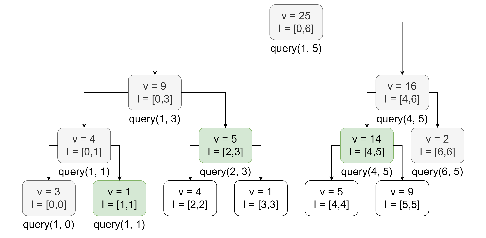

---
<!-- _class: top -->
# RURQ: The Lazy Propagation Technique

- Could we also somehow do the same thing with range updates? That is, could we somehow *return* from a node right away if the update interval contains the node's interval?

---
<!-- _class: top -->
# RURQ: The Lazy Propagation Technique

- Could we also somehow do the same thing with range updates? That is, could we somehow *return* from a node right away if the update interval contains the node's interval?
- The answer is *yes*; However, this is only possible if we *don't* update all of the child nodes.
- We need to *defer* updates at the intermediate nodes (the ones above the leaf nodes) if we want to make range updates as fast as range queries. 
- Since we don't propagate updates down the entire tree right away, this is known as the *lazy propagation* technique.

---
<!-- _class: top -->
# RURQ: The Lazy Propagation Technique
- Let's see a basic example of this technique in action.
- Consider the array $a = [3, 1, 4, 1, 5, 9, 2]$. What is the sum of all values in the array?

---
<!-- _class: top -->
# RURQ: The Lazy Propagation Technique
- Let's see a basic example of this technique in action.
- Consider the array $a = [3, 1, 4, 1, 5, 9, 2]$. What is the sum of all values in the array? Yep, it's **24**.
- Now, what if we add $2$ to *every element* in the interval? What happens to the sum now?

---
<!-- _class: top -->
# RURQ: The Lazy Propagation Technique
- Let's see a basic example of this technique in action.
- Consider the array $a = [3, 1, 4, 1, 5, 9, 2]$. What is the sum of all values in the array? Yep, it's **25**.
- Now, what if we add $2$ to *every element* in the interval? What happens to the sum now? The sum is now **39**. You could either update each element and recompute the sum... or realize that you can simply add $2 \times (\text{the number of elements})$ to the previous sum.
- Notice that if you know the previous total sum, you can easily compute the new total sum after incrementing the whole interval by $v$ simply by adding $v \cdot (r - l + 1)$ to the old value!

---
<!-- _class: top -->
# RURQ: The Lazy Propagation Technique
- In other words, the "add by $v \cdot (r - l + 1)$" trick gives us a way to simulate the effect of a range increment on the sum over an interval *without having to update the child nodes immediately*.
- Now, to handle range updates, we also need to *keep track* of what updates need to be done!

---
<!-- _class: top -->
# RURQ: The Lazy Propagation Technique
- In other words, the "add by $v \cdot (r - l + 1)$" trick gives us a way to simulate the effect of a range increment on the sum over an interval *without having to update the child nodes immediately*.
- Now, to handle range updates, we also need to *keep track* of what updates need to be done.
- This turns out to be quite simple. All we need to do is to store a `lazy` variable per node, representing the total increment that needs to be applied to the *children* nodes.

---
<!-- _class: top -->
# Lazy Propagation Program Flow
- Here's the general flow of a range update when doing lazy propagation:
    1. If a node has unprocessed lazy updates, push the updates to the children first.
    1. If the range update only partially covers a node's interval, recursively apply the range update to its children.
    1. Otherwise, if the range update completely covers a node's interval, update the state of the node, simulating the effect of a range update. Then, update the `lazy` variable of the node (this is how you mark a node as "in need of updates").
- Since the range update propagates like a range query, the total time complexity is $O(\log n)$ per range query (assuming that combining and applying the lazy updates both take $O(1)$)! :exploding_head:

---
<!-- _class: lead -->
# Lazy Propagation Example

---
<!-- _class: top -->
# Lazy Propagation Example

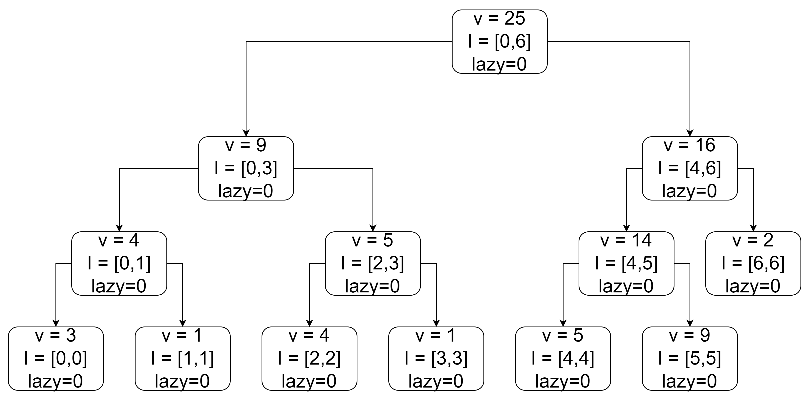

- Take, for example, $a = [3, 1, 4, 1, 5, 9, 2]$

---
<!-- _class: top -->
# Lazy Propagation Example

- This is the segment tree corresponding to the sequence

---
<!-- _class: top -->
# Lazy Propagation Example

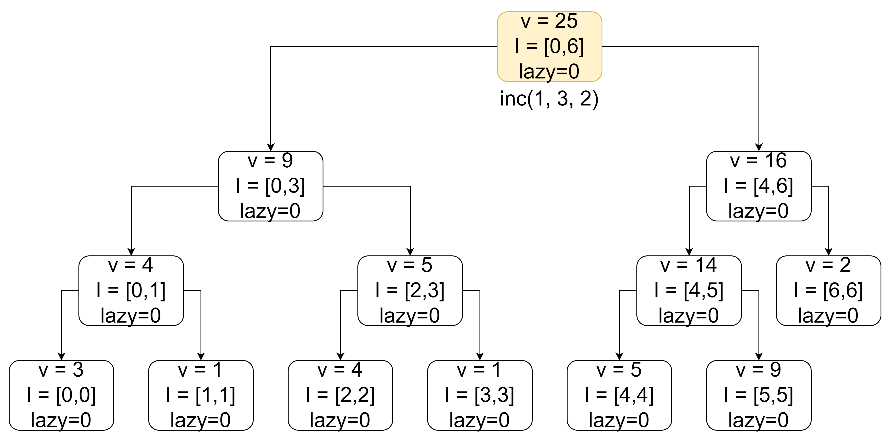

- Let `inc(l, r, v)` denote a range increment by $v$ over $[l, r]$. We will increment everything in $[1, 3]$ by $v = 2$.

---
<!-- _class: top -->
# Lazy Propagation Example

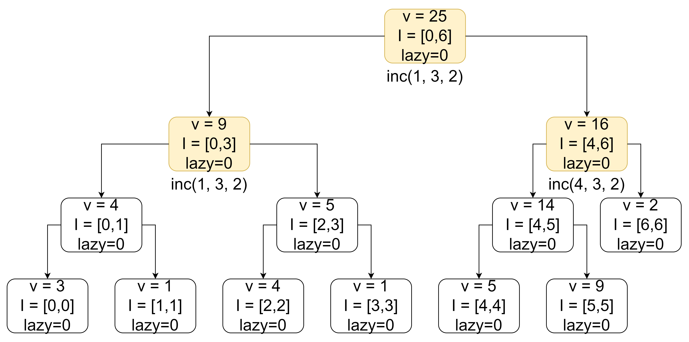

- We first recurse down the tree as needed, ensuring that we push any lazy updates to children.

---
<!-- _class: top -->
# Lazy Propagation Example

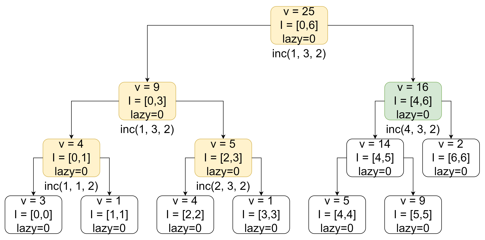

- We first recurse down the tree as needed, ensuring that we push any lazy updates to children.

---
<!-- _class: top -->
# Lazy Propagation Example

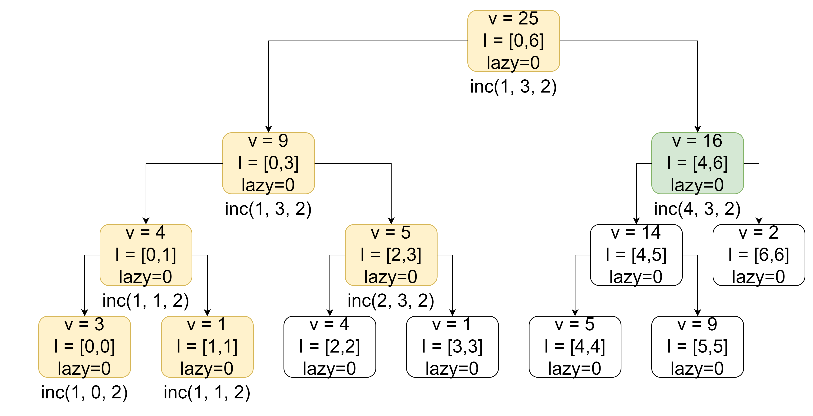

- We first recurse down the tree as needed, ensuring that we push any lazy updates to children.

---
<!-- _class: top -->
# Lazy Propagation Example

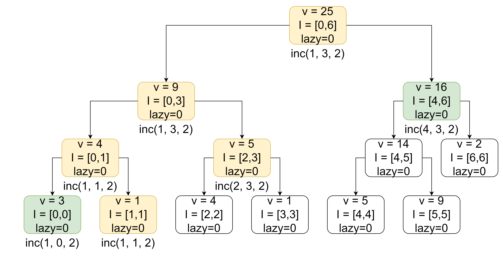

- We first recurse down the tree as needed, ensuring that we push any lazy updates to children.

---
<!-- _class: top -->
# Lazy Propagation Example

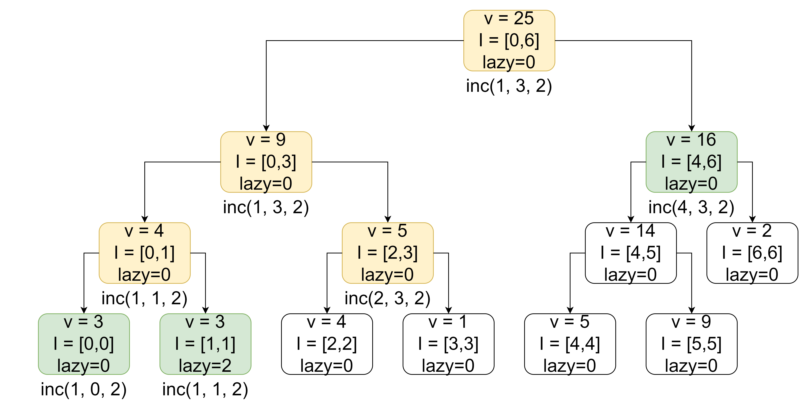

- Once the query interval contains the node interval, we lazily apply the update to the node, then mark it with pending lazy updates to be pushed to its children.

---
<!-- _class: top -->
# Lazy Propagation Example

- Since the child nodes' values have changed, we must update the parent node's value as well.

---
<!-- _class: top -->
# Lazy Propagation Example

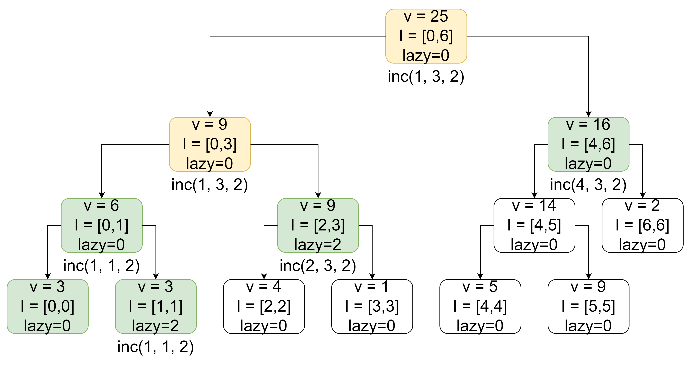

- (Again, if the query interval contains the node interval, update the whole node and mark it as having pending updates that need to be pushed to the children).

---
<!-- _class: top -->
# Lazy Propagation Example

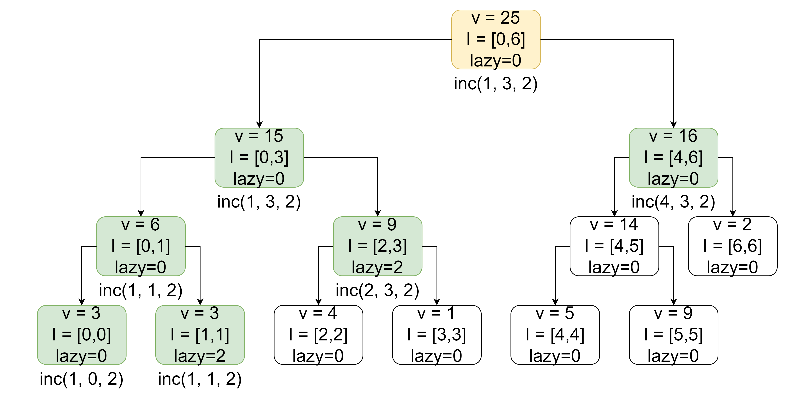

---
<!-- _class: top -->
# Lazy Propagation Example

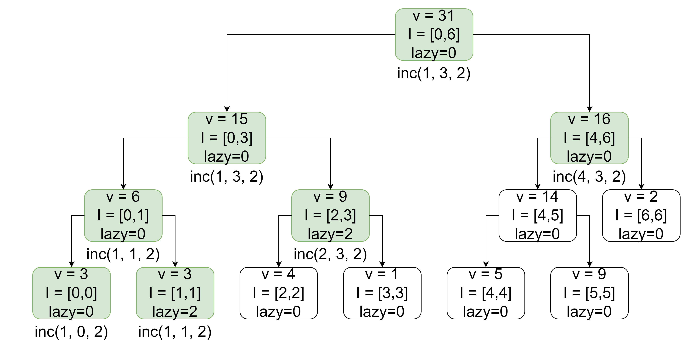

- Done! :smile:

---
<!-- _class: top -->
# Lazy Propagation Example

- Now, what happens if we perform a range update on a node with some pending lazy updates? For instance, what if we increment the range $[2, 3]$ by $-3$?

---
<!-- _class: top -->
# Lazy Propagation Example

- Here, we encounter the node $I = [2, 3]$. Notice that `lazy = 2`, so there are pending lazy updates.

---
<!-- _class: top -->
# Lazy Propagation Example

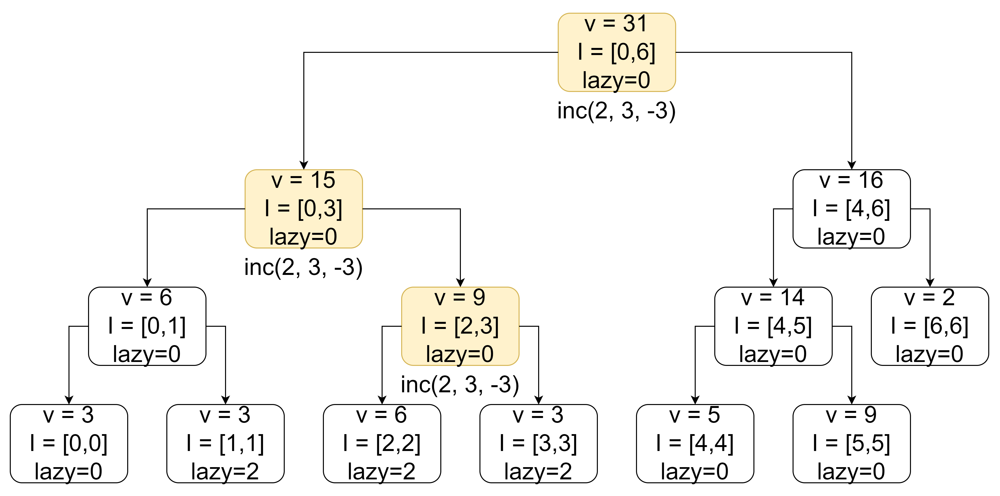

- We *push* the lazy update down to the *children*.

---
<!-- _class: top -->
# Lazy Propagation Example

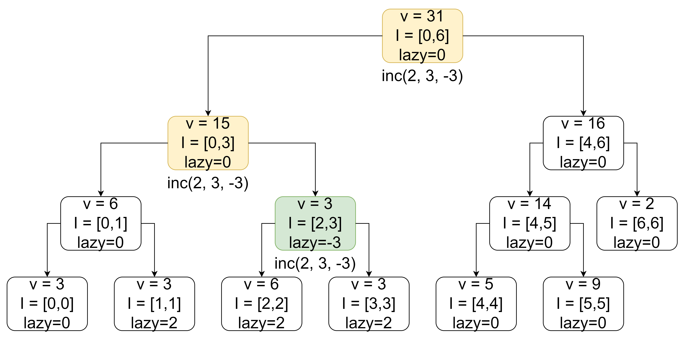

- Then, we *update* the value of node $I = [2, 3]$, simulating the effect of adding $-3$ over the entire range.

---
<!-- _class: top -->
# Lazy Propagation Example

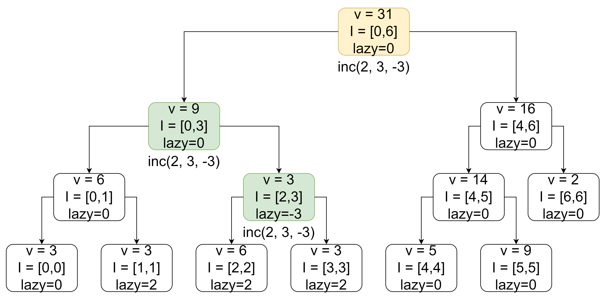

- Finally, we propagate the changes upward.

---
<!-- _class: top -->
# Lazy Propagation Example

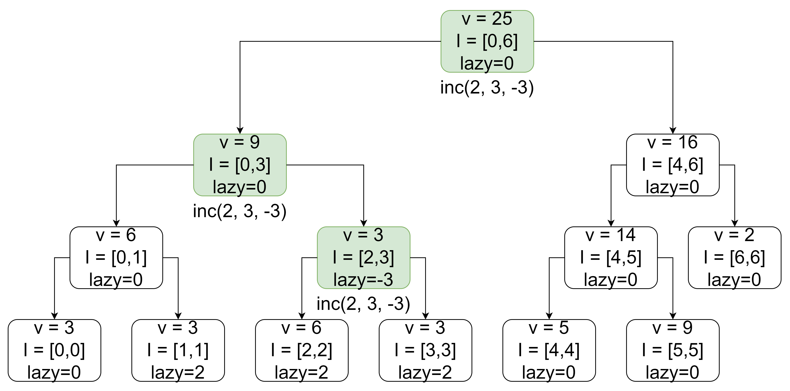

- Finally, we propagate the changes upward.

---
<!-- _class: top -->
# Lazy Propagation Example

- And... we're done! :partying_face:

---
<!-- _class: top -->
# Implementation
- The implementation is quite long. See the GitHub for the implementation: https://github.com/RedBlazerFlame/reboot-materials/tree/main/compprog-materials/veteran/17-lazy-propagation-1/solutions/lazy-sum-segtree.cpp

---
<!-- _class: top -->
# Range Assignment
- What if you instead want to *assign* an entire segment to a single number instead of incrementing it?
- This turns out to be quite simple! All we need to do is to *set* the range sum to $v \cdot (r - l + 1)$ instead of incrementing by it. Also, when you push lazy updates, instead of incrementing the `lazy` variable to merge lazy updates, assign a new value to the `lazy` variable instead.

---
<!-- _class: top -->
# Lazy Propagation with Range Min/Max
- What if you need to instead do range increments/assignments with range minimum queries?
- This turns out to be quite simple too! Adding $v$ to an entire interval will simply increase the minimum by $v$.
- Similarly, assigning $v$ to an entire interval simply sets the minimum to $v$.

---
<!-- _class: top -->
# Why does Lazy Propagation Work?
- Without lazy propagation, we would have to make around the order of $O(n)$ point updates to match the effect of a range update.
- To make range updates as efficient as range queries, we had to stop a range update from propagating through the entire height of the tree. In other words, we had to *defer* updating child nodes if the range update covers the entire node interval.
- By deferring this computation, we ensure that at most $4$ nodes are visited per layer. Since there are $O(\log n)$ layers in the tree, this means that the time complexity of range updates is $O(\log n)$.

---
<!-- _class: top -->
# Why does Lazy Propagation Work?
- In general, whenever you can *efficiently aggregate deferred updates* at a node and then *efficiently apply* updates over the node interval, lazy propagation applies.
- Whenever you need to implement range updates and range queries, ask yourself the following questions:
    1. How can I efficiently "represent" a list of updates in a compressed manner? Could I efficiently combine two pending updates? (eg., could I combine a range increment by $+1$ and another by $+2$ over the same interval? Could I combine a range increment by $+1$ followed by a range assignment to $3$? etc...)
    1. Using the currently deferred updates, could I efficiently update the state of the current node *as if I had updated its children already?* 

---
<!-- _class: top -->

# Lazy Evaluation in a Broader Scope
- Lazy propagation is an example of a more general technique known as **lazy evaluation**.
- Lazy evaluation is when we defer a computation until its result is needed.
- Lazy evaluation is common with functional programming languages, such as Haskell. However, we can also apply it to more imperative programming languages such as C++.
- In the context of CompProg, it allows us to define lazy data structures, infinite data structures, and persistent data structures.
- The opposite of *lazy* evaluation is *eager* evaluation. This is when we perform a computation right away. This is also more common with imperative programming languages.

---
<!-- _class: top -->

# In Summary...

 
 
 

| | **Point Query** | **Range Query** |
|--|--|--|
| **Point Update** | Random-access DS (eg., Array) | Normal Segtree |
| **Range Update** | Segtree on First-order Differences | Lazy Propagating Segtree |

---

<!-- _class: top -->

# Homework

- Check the [Reboot Website](https://redblazerflame.github.io/reboot-materials/compprog-materials/veteran/17-lazy-propagation-1/) for the homework this week. Lazy propagation is definitely black magic. Thus, feel free to **collaborate and discuss with your fellow trainees**. You may also **ask for help from the trainers** and even **read the editorial (but only when you're really stuck)** :smile: