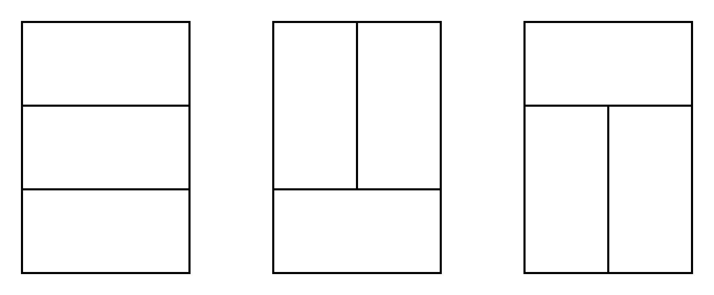
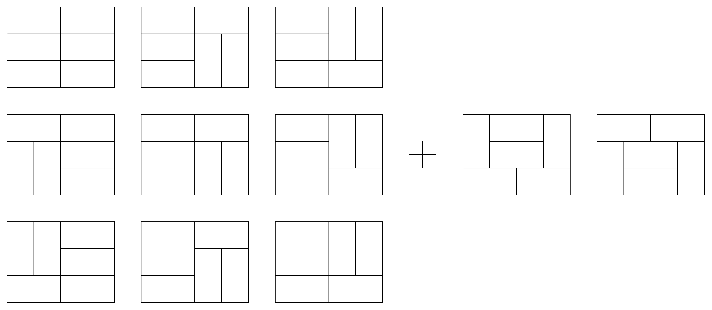
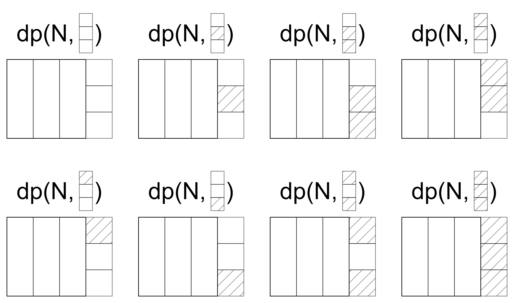
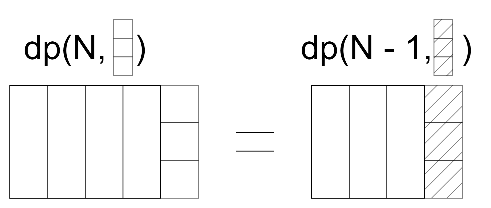
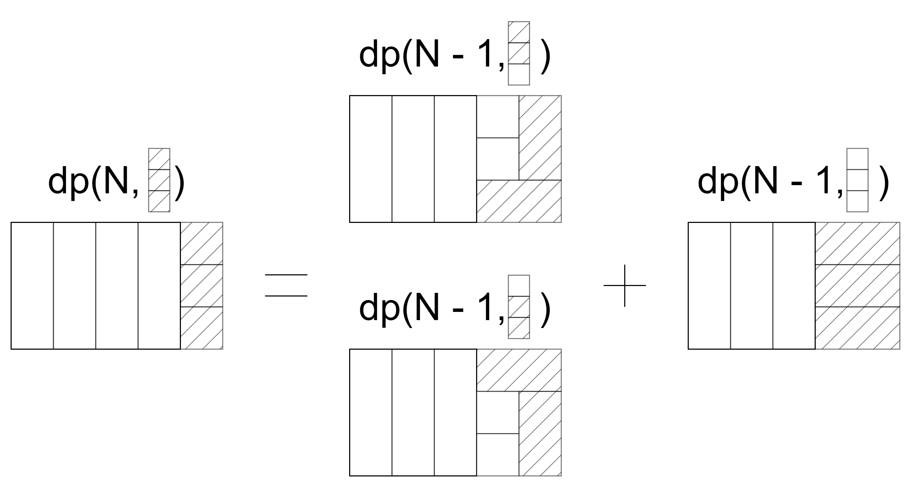
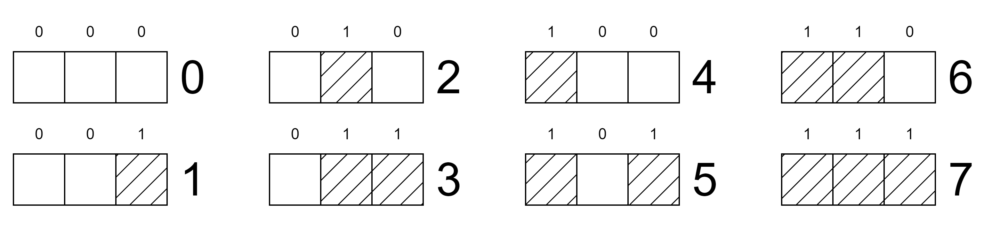

<style>
    @import "../../../slide.css";
</style>

<!-- _class: lead -->

# Dynamic Programming 1
## Veteran Track
## Gabee De Vera

---

<!-- _class: lead -->

# What is Dynamic Programming?

---

<!-- _class: top -->
# What is Dynamic Programming?

**Dynamic Programming** is a technique where we store the answers to previous subproblems to solve the current subproblem.

For example, let's say we try to compute the $n$th Fibonacci number directly from the recurrence,

$$F(x) = \begin{cases} x \text{ if } 0 \le x \le 1 \\ F(x - 1) + F(x - 2) \text{ if } x > 1 \end{cases}$$

---

<!-- _class: top -->
# What is Dynamic Programming?
Let us try computing $F(4)$:

$$
\begin{align}
F(4) & = F(3) + F(2)\\ 
& = F(2) + F(1) + F(1) + F(0)\\ 
& = F(1) + F(0) + F(1) + F(1) + F(0)\\ 
& = 1 + 0 + 1 + 1 + 0\\
& = 3\\ 
\end{align}
$$

That wasn't too bad!

---

<!-- _class: top -->
# What is Dynamic Programming?
Let us try computing $F(5)$:

$$
\begin{align}
F(5) & = F(4) + F(3)\\ 
& = F(3) + F(2) + F(2) + F(1)\\ 
& = F(2) + F(1) + F(1) + F(0) + F(1) + F(0) + F(1)\\ 
& = F(1) + F(0) + F(1) + F(1) + F(0) + F(1) + F(0) + F(1)\\ 
& = 1 + 0 + 1 + 1 + 0 + 1 + 0 + 1\\ 
& = 5\\ 
\end{align}
$$

Yikes! It got worse :fearful:
In fact, computing $F(n)$ like this takes *exponential time*. Specifically, it takes $O(\varphi^n)$ time, where $\varphi = \frac{1 + \sqrt{5}}{2} \approx 1.618033$ is the Golden Ratio.

---

<!-- _class: lead -->
# Thinking Question
## How can we achieve a polynomial time solution using the given recursion?

---

<!-- _class: top -->
# What is Dynamic Programming?
Here's the calculation for $F(5)$ again:

$$
\begin{align}
F(5) & = F(4) + \color{red}F(3)\color{black}\\ 
& = \color{red}F(3)\color{black} + \color{blue}F(2)\color{black} + \color{blue}F(2)\color{black} + F(1)\\ 
& = \color{blue}F(2)\color{black} + F(1) + F(1) + F(0) + F(1) + F(0) + F(1)\\ 
& = F(1) + F(0) + F(1) + F(1) + F(0) + F(1) + F(0) + F(1)\\ 
& = 1 + 0 + 1 + 1 + 0 + 1 + 0 + 1\\ 
& = 5\\ 
\end{align}
$$

Notice that we repeat a lot of computations. If we could retrieve the answer to $F(n)$, where $n < x$ quickly, then we can potentially calculate $F(x)$ in polynomial time.

---

<!-- _class: top -->
# What is Dynamic Programming?
Here's the calculation for $F(5)$ again:

$$
\begin{align}
F(5) & = F(4) + \color{red}F(3)\color{black}\\ 
& = \color{red}F(3)\color{black} + \color{blue}F(2)\color{black} + \color{blue}F(2)\color{black} + F(1)\\ 
& = \color{blue}F(2)\color{black} + F(1) + F(1) + F(0) + F(1) + F(0) + F(1)\\ 
& = F(1) + F(0) + F(1) + F(1) + F(0) + F(1) + F(0) + F(1)\\ 
& = 1 + 0 + 1 + 1 + 0 + 1 + 0 + 1\\ 
& = 5\\ 
\end{align}
$$

Notice that we repeat a lot of computations. If we could retrieve the answer to $F(n)$, where $n < x$ quickly, then we can potentially calculate $F(x)$ in polynomial time.

*Solution:* **Store** the answers to previous subproblems!

---

<!-- _class: top -->
# What is Dynamic Programming?
Let's compute $F(5)$ this way:

$$
\begin{align}
F(0) & = 0\\ 
F(1) & = 1\\ 
F(2) & =\ ?\\ 
F(3) & =\ ?\\ 
F(4) & =\ ?\\ 
F(5) & =\ ?\\ 
\end{align}
$$

---

<!-- _class: top -->
# What is Dynamic Programming?
Let's compute $F(5)$ this way:

$$
\begin{align}
F(0) & = 0\\ 
F(1) & = 1\\ 
F(2) & = F(1) + F(0)\\ 
F(3) & =\ ?\\ 
F(4) & =\ ?\\ 
F(5) & =\ ?\\ 
\end{align}
$$

---

<!-- _class: top -->
# What is Dynamic Programming?
Let's compute $F(5)$ this way:

$$
\begin{align}
F(0) & = 0\\ 
F(1) & = 1\\ 
F(2) & = 1\\ 
F(3) & =\ ?\\ 
F(4) & =\ ?\\ 
F(5) & =\ ?\\ 
\end{align}
$$

---

<!-- _class: top -->
# What is Dynamic Programming?
Let's compute $F(5)$ this way:

$$
\begin{align}
F(0) & = 0\\ 
F(1) & = 1\\ 
F(2) & = 1\\ 
F(3) & = F(2) + F(1)\\ 
F(4) & =\ ?\\ 
F(5) & =\ ?\\ 
\end{align}
$$

---

<!-- _class: top -->
# What is Dynamic Programming?
Let's compute $F(5)$ this way:

$$
\begin{align}
F(0) & = 0\\ 
F(1) & = 1\\ 
F(2) & = 1\\ 
F(3) & = 2\\ 
F(4) & =\ ?\\ 
F(5) & =\ ?\\ 
\end{align}
$$

---

<!-- _class: top -->
# What is Dynamic Programming?
Let's compute $F(5)$ this way:

$$
\begin{align}
F(0) & = 0\\ 
F(1) & = 1\\ 
F(2) & = 1\\ 
F(3) & = 2\\ 
F(4) & = F(2) + F(3)\\ 
F(5) & =\ ?\\ 
\end{align}
$$

---

<!-- _class: top -->
# What is Dynamic Programming?
Let's compute $F(5)$ this way:

$$
\begin{align}
F(0) & = 0\\ 
F(1) & = 1\\ 
F(2) & = 1\\ 
F(3) & = 2\\ 
F(4) & = 3\\ 
F(5) & =\ ?\\ 
\end{align}
$$

---

<!-- _class: top -->
# What is Dynamic Programming?
Let's compute $F(5)$ this way:

$$
\begin{align}
F(0) & = 0\\ 
F(1) & = 1\\ 
F(2) & = 1\\ 
F(3) & = 2\\ 
F(4) & = 3\\ 
F(5) & = F(3) + F(4)\\ 
\end{align}
$$

---

<!-- _class: top -->
# What is Dynamic Programming?
Let's compute $F(5)$ this way:

$$
\begin{align}
F(0) & = 0\\ 
F(1) & = 1\\ 
F(2) & = 1\\ 
F(3) & = 2\\ 
F(4) & = 3\\ 
F(5) & = 5\\ 
\end{align}
$$

That was a lot faster! In fact, this takes $O(n)$ time to compute $F(n)$ at a cost of $O(n)$ *auxiliary memory*. This technique is known as **memoization** (without the r). When we **memoize** a function, we store the results of applying the function on a given set of inputs.

---

<!-- _class: lead top -->
<style scoped>
    pre {
        text-align: left;
    }
</style>

# Implementation of Fibonacci with Memoization

```c++
typedef long long ll;
typedef vector<ll> vll;

const ll MAX_SIZE = 201; // Update this as needed
vll memo(MAX_SIZE, -1ll);
ll fib(ll n) {
    if(n <= 1) return n;
    ll& ans = memo[n];
    if(ans == -1) {
        ans = fib(n - 1) + fib(n - 2);
    }
    return ans;
}
```

---

<!-- _class: lead top -->
# What is Dynamic Programming?

<br>
<br>
<br>

## Dynamic Programming = Brute Force + Memoization

---

<!-- _class: lead -->
# More Common DP Problems

---

<!-- _class: top -->

# Minimum Coin Change

You are given a set of denominations $C$ with values $C = \left\{1, c_0, c_1, c_2, c_3, ..., c_n\right\}$, in Pesos. What is the **minimum number of coins** needed to pay for an item that costs $n$ Pesos? You may use a denomination multiple times. All denominations are integers.

Say, for example, we want to make change for an item with price $n = 30$ with denominations $C = \left\{1, 4, 10, 21\right\}$. Then, surely, the best strategy is to keep taking the largest possible denomination that fits, right? So $30 = 21 + 9 = 21 + 4 + 5 = 21 + 4 + 4 + 1$; therefore, at least $4$ coins are needed to make change for $n = 30$.

---

<!-- _class: top -->

# Minimum Coin Change: The Greedy Approach

You are given a set of denominations $C$ with values $C = \left\{1, c_0, c_1, c_2, c_3, ..., c_n\right\}$, in Pesos. What is the **minimum number of coins** needed to pay for an item that costs $n$ Pesos? You may use a denomination multiple times. All denominations are integers.

Say, for example, we want to make change for an item with price $n = 30$ with denominations $C = \left\{1, 4, 10, 21\right\}$. Then, surely, the best strategy is to keep taking the largest possible denomination that fits, right? So $30 = 21 + 9 = 21 + 4 + 5 = 21 + 4 + 4 + 1$; therefore, at least $4$ coins are needed to make change for $n = 30$.

**WRONG.** You can make change for $n = 30$ using only **three** coins, since $30 = 10 + 10 + 10$.

---

<!-- _class: top -->

# Minimum Coin Change: When Greedy Fails

What went wrong with the previous solution? Based on our real life experience, we assumed that the optimal move at any given point is to pick the largest denomination that fits, **but this is not always true**. 

---

<!-- _class: top -->

# Minimum Coin Change: When Greedy Fails

What went wrong with the previous solution? Based on our real life experience, we assumed that the optimal move at any given point is to pick the largest denomination that fits, **but this is not always true**. 

What we used is an example of a **greedy** algorithm. While they sometimes work, they oftentimes don't. Greedy algorithms need to be proven correct before usage (to be discussed in a later module). For now, here's my tip: **Greedy is bad if it's correctness is unproven**. Avoid greedy unless you have proven its correctness.

---

<!-- _class: top -->

# Minimum Coin Change: The Brute Force Approach

It seems like we need to somehow account for all possible ways to choose the denominations. This may seem daunting, after all, there are $20$ different ways to make change for $30$ pesos using denominations of $1, 4, 10,$ and $21$ peso coins. This will only get worse as $n$ becomes larger!

---

<!-- _class: top -->

# Minimum Coin Change: The Brute Force Approach

It seems like we need to somehow account for all possible ways to choose the denominations. This may seem daunting, after all, there are $20$ different ways to make change for $30$ pesos using denominations of $1, 4, 10,$ and $21$ peso coins. This will only get worse as $n$ becomes larger!

This may seem daunting, after all, there are $20$ different ways to make change for $30$ pesos using denominations of $1, 4, 10,$ and $21$ peso coins. This will only get worse as $n$ becomes larger!

---

<!-- _class: top -->

# Minimum Coin Change: The Brute Force Approach

It seems like we need to somehow account for all possible ways to choose the denominations. This may seem daunting, after all, there are $20$ different ways to make change for $30$ pesos using denominations of $1, 4, 10,$ and $21$ peso coins. This will only get worse as $n$ becomes larger!

This may seem daunting, after all, there are $20$ different ways to make change for $30$ pesos using denominations of $1, 4, 10,$ and $21$ peso coins. This will only get worse as $n$ becomes larger!

*Solution:* **Store** the answers to previous subproblems!

---

<!-- _class: top -->

# Minimum Coin Change: The DP Approach

Let's say that the smallest number of coins needed to pay for $n$ pesos is $\text{ans}(n)$. Now, let us take a leap of faith: suppose that we already *know* the answers to $\text{ans}(0)$, $\text{ans}(1)$, $\text{ans}(2)$, ..., $\text{ans}(n - 1)$. Could we somehow reconstruct the answer to $\text{ans}(n)$?

---

<!-- _class: top -->

# Minimum Coin Change: The DP Approach

Let's say that the smallest number of coins needed to pay for $n$ pesos is $\text{ans}(n)$. Now, let us take a leap of faith: suppose that we already *know* the answers to $\text{ans}(0)$, $\text{ans}(1)$, $\text{ans}(2)$, ..., $\text{ans}(n - 1)$. Could we somehow reconstruct the answer to $\text{ans}(n)$?

It turns out that we can! Consider the last denomination used, $c$. Assuming the last denomination used is $c$, the number of coins used to pay for $n$ pesos is $\text{ans}(n) = 1 + \text{ans}(n - c)$. We can *brute force* through all possible denominations $c$, giving us the following recurrence,

$$\text{ans}(n) = \min_{c \in C, n - c \ge 0} \left(\text{ans}(n - c) + 1\right)$$

---

<!-- _class: top -->

# Minimum Coin Change: The DP Approach

Now, what is the base case?

---

<!-- _class: top -->

# Minimum Coin Change: The DP Approach

Now, what is the base case?

The base case is $\text{ans} (0) = 0$, because it takes $0$ coins to pay for something free!

---

<!-- _class: top -->

# Minimum Coin Change: The DP Approach

Now, what is the base case?

The base case is $\text{ans} (0) = 0$, because it takes $0$ coins to pay for something free!

What's the running time of the solution?

---

<!-- _class: top -->

# Minimum Coin Change: The DP Approach

Now, what is the base case?

The base case is $\text{ans} (0) = 0$, because it takes $0$ coins to pay for something free!

What's the running time of the solution?

We need to compute $\text{ans} (x)$ for $0 \le x \le n$. Also, to compute each $\text{ans} (x)$, we need to sum at most $|C|$ values, representing all possible last denominations that could have been picked. Thus, the running time of the solution is $O(n|C|)$.

---

<!-- _class: top lead -->

<style scoped>
    pre, code {
        text-align: left;
    }
</style>

# Minimum Coin Change: Top-down Implementation

```c++
typedef vector<int> vi;
const int MAX_MEMO = 200'001;
// numeric_limits<int>::max() acts as "positive infinity"
vi memo(MAX_MEMO, numeric_limits<int>::max());
int min_change(const vi& c, int n) {
    if(n == 0) return 0;
    int& ans = memo[n];
    if(ans == numeric_limits<int>::max()) {
        for(int cur_denom : c) {
            // Skip the current denomination if it doesn't fit
            if(n - cur_denom < 0) continue;
            ans = min(ans, min_change(c, n - cur_denom) + 1);
        }
    }
    return ans;
}
```

---

<!-- _class: top lead -->

<style scoped>
    pre, code {
        text-align: left;
    }
</style>

# Minimum Coin Change: Bottom-up Implementation

<br>
<br>

```c++
typedef vector<int> vi;

// ... Inside the Driver Function
vi ans(n + 1, numeric_limits<int>::max());
ans[0] = 0;
for(int i = 1; i <= n; i++) {
    for(int c : denoms) if(i - c >= 0) ans[i] = min(ans[i], ans[i - c] + 1);
}
```

---

<!-- _class: lead -->

# Bitmask DP

---

<!-- _class: top -->

# Bitmask DP

Motivating problem: how many ways are there to tile an $N \times M$ grid with identical $1 \times 2$ and $2 \times 1$ dominoes, where $1 \le M \le 1000$, and $1 \le N \le 10$?

---

<!-- _class: top -->

# Bitmask DP

Motivating problem: how many ways are there to tile an $N \times M$ grid with identical $1 \times 2$ and $2 \times 1$ dominoes, where $1 \le M \le 1000$, and $1 \le N \le 10$?

Note that, since dominoes occupy $2$ grid tiles each, there must be an even number of tiles. Otherwise, it is impossible to tile the grid.

---

<!-- _class: top -->

# Bitmask DP

Motivating problem: how many ways are there to tile an $N \times M$ grid with identical $1 \times 2$ and $2 \times 1$ dominoes, where $1 \le M \le 1000$, and $1 \le N \le 10$?

Note that, since dominoes occupy $2$ grid tiles each, there must be an even number of tiles. Otherwise, it is impossible to tile the grid.

For now, we will consider the case $N = 3$. The general case of $1 \le N \le 10$ will be left as an exercise.

---

<!-- _class: top -->

# Bitmask DP

Let us first try small cases. Consider $N = 3$ and $M = 2$. There are 3 possible tilings, shown below.



---

<!-- _class: top -->

# Bitmask DP

Let us first try small cases. Consider $N = 3$ and $M = 4$. There are 11 possible tilings, shown below.



---

<!-- _class: top -->

# Bitmask DP

What about when $N = 3$ and $M = 0$? How many tilings are there?

---

<!-- _class: top -->

<style scoped>
    h2:last-of-type {
        align-self: center;
    }
</style>

# Bitmask DP

What about when $N = 3$ and $M = 0$? How many tilings are there?

<br>
<br>

## There is Exactly ONE Tiling (The Empty Tiling)

---

<!-- _class: top -->

# Bitmask DP

Now, let us try to find a DP solution to this problem.

What DP state should we use? This turns out to be nontrivial, so feel free to think about it for a moment.

---

<!-- _class: top -->

# Bitmask DP

Now, let us try to find a DP solution to this problem.

What DP state should we use? This turns out to be nontrivial, so feel free to think about it for a moment.

---

<!-- _class: top -->

# Bitmask DP

Notice that you can **perform casework on the final column**. You can assume that some tiles in the final column are currently occupied, while some are unoccupied, like so.



---

<!-- _class: top -->

# Bitmask DP

Then, for each possible state of the final row, we can do some casework to determine how it relates to smaller cases.



---

<!-- _class: top -->

# Bitmask DP

Then, for each possible state of the final row, we can do some casework to determine how it relates to smaller cases.



---

<!-- _class: top -->

# Bitmask DP

But now, how do we represent the state of the last column in code? Notice that each tile in the last column could either be **occupied** or **not occupied**.
Thus, there is a **binary choice** per tile of whether or not it should be occupied. We can then associate each ending state with a unique integer, like so.



This integer is known as a **bitmask**. Bitmasks are a fancy way of storing an array of booleans in a single number.

---

<!-- _class: top -->

# Bitmask DP

Bitmasks have a lot of advantages. For instance, you can use bitmask operations such as bitwise right shift and bitwise AND to extract the $n$th bit of a bitmask.

$$
\begin{align}
3\text{rd bit of }11010_{2} & = \left(11010_{2} >> 3\right) \& 1_{2}\\ 
& = \left(110_{2}\right) \& 1_{2}\\ 
& = 0_{2}
\end{align}
$$

See [this video](https://www.youtube.com/watch?v=xXKL9YBWgCY) for more information on bitmasks.

---

<!-- _class: top -->

# Bitmask DP

Now, all that's left to do is to complete the casework on all other possible states of the last column. You also need to determine the initial values of the DP. This will be left as an exercise for you to accomplish.


---

<!-- _class: top -->

# Bitmask DP

To generalize to $1 \le N \le 10$, you have to **programmatically** perform your DP transition (please do not do the DP transitions manually ;-;).

The time complexity of this solution is $O(M2^N)$, which should pass.

---

<!-- _class: lead -->

# DP is Powerful

---

<!-- _class: top -->

# Things DP can Do

1. It can turn certain brute force solutions, which may run in exponential time, to something that runs in polynomial time.

---

<!-- _class: top -->

# Things DP can Do

1. It can turn certain brute force solutions, which may run in exponential time, to something that runs in polynomial time.
1. It can turn solutions that run in factorial time to solutions that run in exponential time.

---

<!-- _class: top -->

# Things DP can Do

1. It can turn certain brute force solutions, which may run in exponential time, to something that runs in polynomial time.
1. It can turn solutions that run in factorial time to solutions that run in exponential time.
1. It can compute the $n$th term of a linear recurrence in $O(\log n)$ time. In particular, it allows you to calculate the $n$th Fibonacci number in $O(\log n)$ time. More on this next week!

---

<!-- _class: top -->

# Things DP can Do

1. It can turn certain brute force solutions, which may run in exponential time, to something that runs in polynomial time.
1. It can turn solutions that run in factorial time to solutions that run in exponential time.
1. It can compute the $n$th term of a linear recurrence in $O(\log n)$ time. In particular, it allows you to calculate the $n$th Fibonacci number in $O(\log n)$ time. More on this next week!
1. Etc...

---

<!-- _class: top -->

# Homework

See the [Reboot Page](https://redblazerflame.github.io/reboot-materials/compprog-materials/veteran/5-dp-2/) for your homework this week :smile: