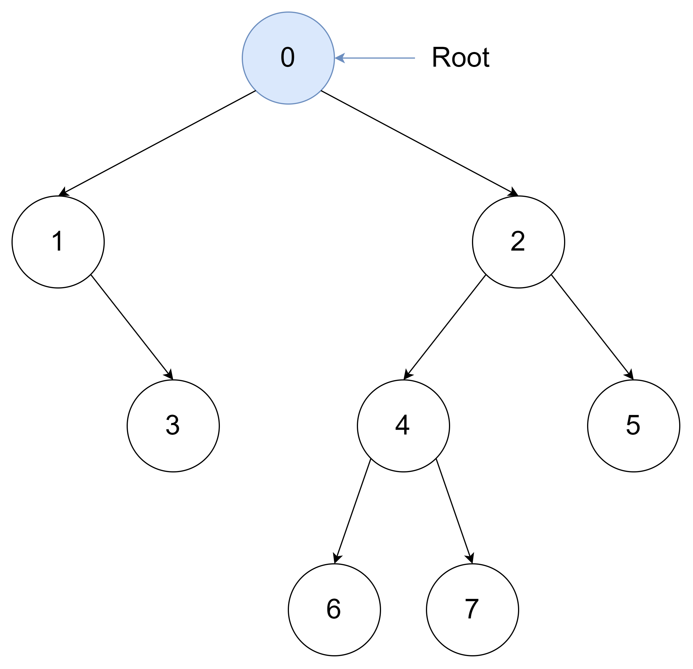
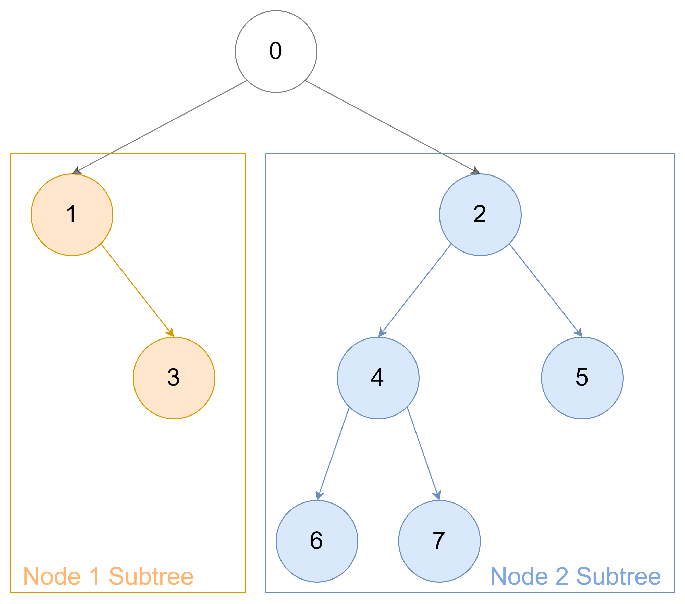
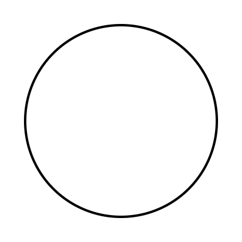
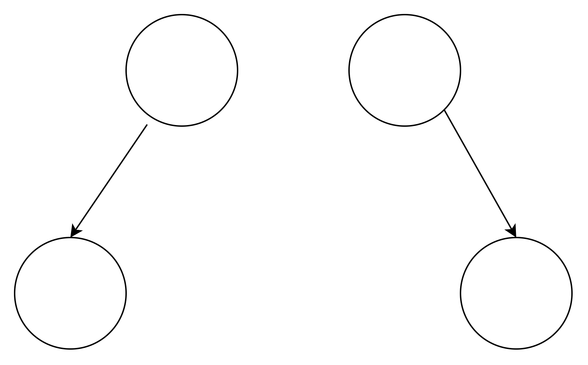
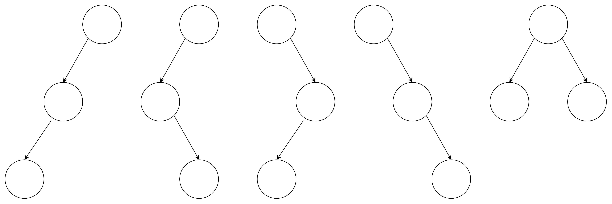
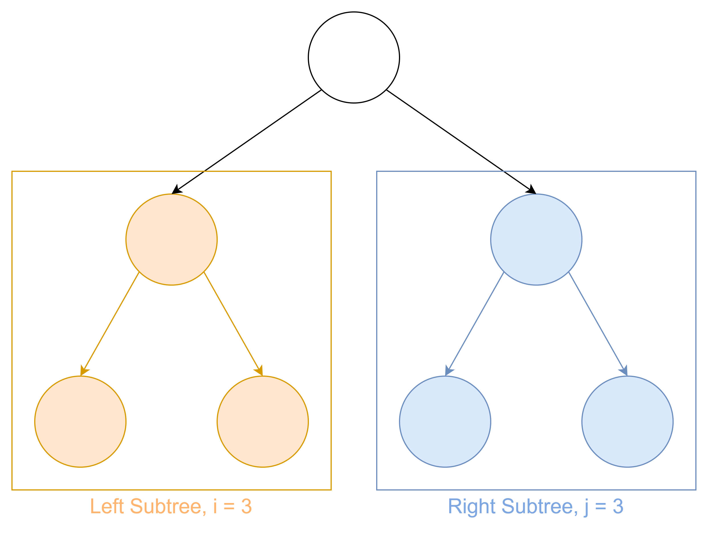
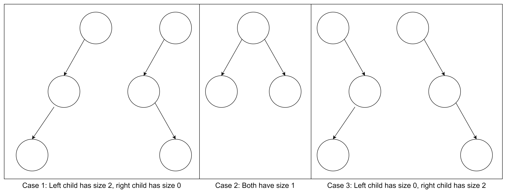
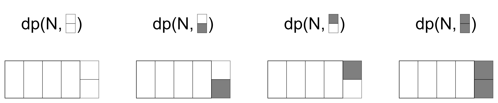

<style>
    @import "../../../slide.css";
</style>

<!-- _class: lead -->

# Dynamic Programming 2
## Veteran Track
## Gabee De Vera

---

<!-- _class: lead -->

# Trees are Cool!

---

<!-- _class: top lead -->

# NOT These Trees

## (JOKE of course these trees are cool! :cherry_blossom:)


---

<!-- _class: top lead -->

# THESE Trees

## (But these are also cool!)


---

<!-- _class: top -->

# Trees

- **Trees** are graphs (they have circles, known as "nodes", connected by arrows, known as "edges") where the nodes "branch" out
- For this lesson, we will focus on a particular type of tree known as a **rooted tree**

---

<!-- _class: top -->

# Rooted Tree
- A **rooted tree** contains a **root**
- The **root** of a tree is the node at the "top" of the tree. Formally, the root node is the only node of the rooted tree **that does not have a parent**



---

<!-- _class: top -->

# Rooted Tree
- The **children** of a node are the nodes directly below it. For instance, 1 and 2 are node 0's children, while 4 and 5 are node 2's children (but are not node 0's children).
- The **parent** of the node is the node directly above it. For instance, node 0 is node 1's parent.


---

<!-- _class: top -->

# Rooted Trees are Recursive

- A child node of the root node itself forms a *subtree* (highlighted in blue and orange). Thus, rooted trees have a **recursive structure**.



---

<!-- _class: top -->

# Rooted Trees are Recursive

- In fact, we can define a rooted tree *recursively*, as follows,

- A **rooted tree** is a graph that consists of either:
    1. A single node, or,
    2. A node with one or multiple children, each forming another rooted subtree

---

<!-- _class: top -->

# DP on Trees: Computing Subtree Sizes
- Since trees have a recursive structure, we can run recursive algorithms on them. Even better, we can **apply DP on trees!**
- Consider this problem: **Given a rooted, labeled tree, for each node, count how many nodes there are in its subtree**

---
# DP on Trees: Computing Subtree Sizes
- We can **exploit the recursive nature of trees** to compute this value. Suppose that $\text{Size}(i)$ returns the number of nodes in the subtree of node $i$ (including itself).
- Let us consider node $i$. Let its children be $\text{Children}(i)$
- Then, if node $i$ has no children, i.e., $\text{Children}(i) = 0$, then $\text{Size}(i) = 1$ since the only node in its subtree is itself.
- Meanwhile, if node $i$ has multiple children, then we can simply sum up the number of nodes in the subtrees of its children. Finally, we need to include node $i$ itself in the count.
- Thus, the recursive case is $\text{Size}(i) = 1 + \sum_{j \in \text{Children}(i)} \text{Size}(j)$.

---

<!-- _class: top -->

# DP on Trees: Computing Subtree Sizes
- One possible implementation

```c++
typedef long long ll;
ll solve(const vector<vector<ll>& children, vector<ll>& sizes, ll i) {
    sizes[i] = 1ll;
    for(ll j : adj[i]) {
        sizes[i] += solve(children, sizes, j);
    }
    return sizes[i];
}
```

---

<!-- _class: top -->

# DP on Trees: Computing Subtree Sizes
- A shorter implementation
- Just **one line** of c++!
- Lesson: **Learn the C++ Standard Library! (STL)**

```c++
typedef long long ll;
ll solve(const vector<vector<ll>& children, vector<ll>& sizes, ll i) {
    return sizes[i] = accumulate(children[i].begin(), children[i].end(), 1ll,
    [&children, &sizes](ll acc, ll j){return acc + solve(children, sizes, j);});
}
```

---

<!-- _class: top -->

# DP on Trees: Counting Rooted Binary Trees

- Consider another problem on trees: **How many rooted binary trees are there with $n$ nodes?**
- A **binary tree** is a tree where all nodes have at most two children.
- When $n = 1$, there is only one tree, shown below:



---

<!-- _class: top -->

# DP on Trees: Counting Rooted Binary Trees

- When $n = 2$, there are 2, since the second node could be to the left or right of the root.



---

<!-- _class: top -->

# DP on Trees: Counting Rooted Binary Trees

- When $n = 3$, there are 5, as shown below.



---

<!-- _class: top -->

# DP on Trees: Counting Rooted Binary Trees

- To simplify our calculations later, how many rooted binary trees are there with $n = 0$? :thinking:

---

<!-- _class: top -->

<style scoped>
    h1:last-of-type, h2:last-of-type {
        text-align: center;
    }
</style>

# DP on Trees: Counting Rooted Binary Trees

- To simplify our calculations later, how many rooted binary trees are there with $n = 0$? :thinking:

<br>

# There is Exactly One
## (The Null Tree with Zero Nodes)

---

<!-- _class: top -->

# DP on Trees: Counting Rooted Binary Trees

- To solve this problem, we will again *exploit the recursive nature of trees* :sparkles:
- Let us try to build a binary tree. A binary tree with $n$ nodes contains a root node, as well as two binary subtrees with sizes $i$ and $j$. Additionally, $i + j + 1 = n$, since the total number of nodes must be $n$.

---

<!-- _class: top -->

# DP on Trees: Counting Rooted Binary Trees
- Here's an example of a binary tree with $n = 7$. The left and right subtrees both have $i = j = 3$ nodes, for a total of $i + j + 1 = 7 = n$ nodes.



---

<!-- _class: top -->

# DP on Trees: Counting Rooted Binary Trees

- For example, let us count the number of rooted binary trees with $n = 3$. There are three cases: (1) $i = 2, j = 0$, (2) $i = j = 1$, and (3) $i = 0, j = 3$, as shown below:



---

<!-- _class: top -->

# DP on Trees: Counting Rooted Binary Trees

- Let $C(n)$ be the number of rooted binary trees with $n$ nodes.
- Why "C"? We'll get to that later! :smile:
- Thus, we now have $C(3) = C(2)C(0) + C(1)C(1) + C(0)C(2)$.
- In general, we can sum over all possible sizes of the subtrees to get $C(n) = \sum_{i, j \text{ such that } i + j + 1 = n} C(i)C(j)$.
- Since $j = n - i - 1$, we have:
$$C(n) = \sum_{i = 0}^{n - 1} C(i)C(n - i - 1)$$

- We now have a **recursive formula** for the number of rooted binary trees! :open_mouth:

---

<!-- _class: top -->

# DP on Trees: Counting Rooted Binary Trees

$$C(n) = \sum_{i = 0}^{n - 1} C(i)C(n - i - 1)$$

- Of course, computing this directly will take exponential time, so we will again **memoize the values of $C(n)$**.
- Using memoization, we can then compute $C(n)$ in $O(n^2)$, **yay!!** :partying_face:

---

<!-- _class: top -->

# DP on Trees: Counting Rooted Binary Trees

$$C(n) = \sum_{i = 0}^{n - 1} C(i)C(n - i - 1)$$

- Of course, computing this directly will take exponential time, so we will again **memoize the values of $C(n)$**.
- Using memoization, we can then compute $C(n)$ in $O(n^2)$, **yay!!** :partying_face:

- The sequence $C(n)$ is known as the the **Catalan Numbers**. Catalan Numbers are ubiquitous in combinatorics. These count many similar classes of combinatorial objects, including parenthesizations, regular polygonal triangulations, Dyck paths, and so much more! See [this video](https://www.youtube.com/watch?v=TAuJV5eNKLM) to learn more about Catalan Numbers.

---

<!-- _class: top -->

# DP on Trees: Counting Rooted Binary Trees

- **BONUS:** The $n$th Catalan Number could be computed in $O(n)$ (assuming you're computing $C(n) \mod p$ for some number $p$ to avoid slowdown due to arithmetic on large integers)
- I leave it to you to figure out how :smile:
- As a hint, the following formula for the $n$th Catalan Number may help:

$$C(n) = \frac{1}{n + 1} \begin{pmatrix}2n \\ n\end{pmatrix}$$

---
<!-- _class: top -->

# DP on Trees: Counting Rooted Binary Trees

- Implementation:

```c++
// You would usually apply %MOD since the catalan numbers grow quickly
vector<int> catalan;
catalan.push_back(1);
for(int n = 1; n <= N; n++) {
    int ans = 0;
    for(int i = 0; i < n; i++) {
        ans += catalan[i] * catalan[n - i - 1];
    }
    catalan.push_back(ans);
}
cout << catalan[N] << endl;
```

---

<!-- _class: lead -->

# Linear Recurrences and Fast Matrix Exponentiation

---
<!-- _class: top -->

# Linear Recurrences: An Alternative Approach

- Before proceeding, **watch [this video](https://www.youtube.com/watch?v=fNk_zzaMoSs) on Vectors and [this video](https://www.youtube.com/watch?v=OMA2Mwo0aZg) on Matrix Multiplication**.

- Consider the Fibonacci numbers, which satisfy $F(n) = F(n - 1) + F(n - 2)$
- Normally, we can compute this in $O(n)$ by directly computing the recurrence and applying memoization
- Let's try to find an *alternative approach* to computing the $n$th Fibonacci number

---
# Linear Recurrences: An Alternative Approach

- Let $\vec{F}(n) = \begin{bmatrix} F(n) \\ F(n - 1)\end{bmatrix}$. We want to relate $\vec{F}(n)$ and $\vec{F}(n - 1)$ somehow.
- Note that we include $F(n - 1)$ in $\vec{F}(n)$ as well to keep track of previous terms. This will be relevant in setting up the recurrence.
- Notice that the recurrence $F(n) = F(n - 1) + F(n - 2)$ is **linear**! In other words, there are no squares or products of previous terms. Every subsequent term is simply a *linear combination* of the previous terms.
- This hints to us that we can use a *linear transformation* -- i.e., a *matrix* -- to represent the relation between $\vec{F}(n)$ and $\vec{F}(n - 1)$.
- Let $a, b, c, d$ be some real numbers. Our working recurrence is now:

$$\vec{F}(n) = \begin{bmatrix}a & b \\ c & d\end{bmatrix}\vec{F}(n - 1)$$

---
<!-- _class: top -->
# Linear Recurrences: An Alternative Approach

$$\vec{F}(n) = \begin{bmatrix}a & b \\ c & d\end{bmatrix}\vec{F}(n - 1)$$

- Let us expand out this expression, like so,

$$\begin{bmatrix} F(n) \\ F(n - 1)\end{bmatrix} = \begin{bmatrix}a & b \\ c & d\end{bmatrix}\begin{bmatrix} F(n - 1) \\ F(n - 2)\end{bmatrix}$$

- By performing the matrix-vector multiplication, we get the following systems of equations:

$$\begin{cases}F(n) = aF(n - 1) + bF(n - 2) \\ F(n - 1) = cF(n - 1) + dF(n - 2)\end{cases}$$

---
<!-- _class: top -->
# Linear Recurrences: An Alternative Approach

$$\begin{cases}F(n) = aF(n - 1) + bF(n - 2) \\ F(n - 1) = cF(n - 1) + dF(n - 2)\end{cases}$$

- Notice that $a = b = 1$ satisfies the first equation. Meanwhile, $c = 1$ and $d = 0$ satisfies the second. Therefore, our recurrence is now,

$$\vec{F}(n) = \begin{bmatrix}a & b \\ c & d\end{bmatrix}\vec{F}(n - 1) = \begin{bmatrix}1 & 1 \\ 1 & 0\end{bmatrix}\vec{F}(n - 1)$$

---

<!-- _class: top -->

# Linear Recurrences: An Alternative Approach

$$\vec{F}(n) = \begin{bmatrix}1 & 1 \\ 1 & 0\end{bmatrix}\vec{F}(n - 1)$$

- So now, how long would it take to compute $\vec{F}(n)$ and, by extension, $F(n)$?
- Each matrix multiplication would take $O(d^3)$, where $d$ is the size of the matrix. For the matrix we found for the Fibonacci numbers, this is $d = 2$, since there are two rows and two columns.
- To get to $\vec{F}(n)$, we need $O(n)$ matrix multiplications, giving us a final complexity of $O(nd^3)$. This seems worse than our original method! :pensive:
- How do we improve this?

---

<!-- _class: top -->

# Fast Matrix Exponentiation

- Notice the following:

$$\vec{F}(2) = \begin{bmatrix}1 & 1 \\ 1 & 0\end{bmatrix}\vec{F}(1) = \begin{bmatrix}1 & 1 \\ 1 & 0\end{bmatrix}^2\vec{F}(0)$$

- To compute $\vec{F}(n)$ in terms of $\vec{F}(n - 2)$ we can **square** the matrix!
- We can do this again! To compute $\vec{F}(n)$ in terms of $\vec{F}(n - 4)$, we can square the matrix again!
- Keep doing this, and you can make exponentially larger and larger jumps!

---

<!-- _class: top -->

# Fast Matrix Exponentiation

- Let us formalize the previous observation. Note that the following equality holds,

$$\vec{F}(n) = \begin{bmatrix}1 & 1 \\ 1 & 0\end{bmatrix}^n\vec{F}(0)$$

- However, we can **compute $\begin{bmatrix}1 & 1 \\ 1 & 0\end{bmatrix}^n$ in $O(d^3 \log n)$ using fast *matrix* exponentiation**, similar to how we can compute $a^b$ quickly for natural numbers

- Consider a matrix $M$. To compute $M^n$, we can use the following recursive formula,

$$M^n = \begin{cases}M\left(M^{\frac{n - 1}{2}}\right)^2 \text{ if } n \text{ is odd} \\ \left(M^{\frac{n}{2}}\right)^2 \text{ if } n \text { is even} \end{cases}$$

---
<!-- _class: top -->

# Fast Matrix Exponentiation

$$\vec{F}(n) = \begin{bmatrix}1 & 1 \\ 1 & 0\end{bmatrix}^n\vec{F}(0)$$

- Using fast matrix exponentiation, we can compute the $n$th Fibonacci number in $O(d^3 \log n)$ time using the above formula :partying_face:

- **Thinking Question:** $\vec{F}(n) = \begin{bmatrix}F(0) \\ F(-1)\end{bmatrix}$. If $F(0) = 0$ and $F(1) = 1$, then what is $F(-1)$?

---
<!-- _class: top -->

# Fast Matrix Exponentiation

- The implementation for fast matrix exponentation is rather long. See the following code in GitHub for the implementation: [https://github.com/RedBlazerFlame/reboot-materials/tree/main/compprog-materials/veteran/5-dp-2/solutions/fibonacci.cpp](https://github.com/RedBlazerFlame/reboot-materials/tree/main/compprog-materials/veteran/5-dp-2/solutions/fibonacci.cpp)
- For more info on Fast Matrix Exponentiation, see [Errichto's Video on this topic](https://www.youtube.com/watch?v=eMXNWcbw75E).

---
<!-- _class: top -->

# Fast Matrix Multiplication: Applications

- You can generalize the fast matrix multiplication algorithm to *any linear recurrence*.
- Consider, for instance, the sequence $T(n) = T(n - 1) + 2T(n - 3)$. Then, define $\vec{T}(n) = \begin{bmatrix}T(n) \\ T(n - 1) \\ T(n - 2)\end{bmatrix}$. By using the same techniques, you will find that,

$$\vec{T}(n) = \begin{bmatrix}1 & 0 & 2 \\ 1 & 0 & 0 \\ 0 & 1 & 0\end{bmatrix} \vec{T}(n - 1) = \begin{bmatrix}1 & 0 & 2 \\ 1 & 0 & 0 \\ 0 & 1 & 0\end{bmatrix}^n \vec{T}(0)$$

---
<!-- _class: top -->

# Fast Matrix Multiplication: Applications

- You can also apply Fast Matrix Multiplication to **certain tiling problems** since the recurrences involved are often linear
- For instance, imagine you wanted to count the number of ways to tile a $2 \times n$ grid with $2 \times 1$ dominoes. As a refresher, last week, we learned how to solve this problem in $O(n)$ using bitmask DP. The idea is to store all possible "partial coverings" of the last row in the DP state using bitmasks.



---
<!-- _class: top -->

# Fast Matrix Multiplication: Applications


- Then, we can use the following recurrences,

$$\text{dp}(n, 0) = \text{dp}(n - 1, 3)$$
$$\text{dp}(n, 1) = \text{dp}(n - 1, 2)$$
$$\text{dp}(n, 2) = \text{dp}(n - 1, 1)$$
$$\text{dp}(n, 3) = \text{dp}(n - 1, 0) + \text{dp}(n - 1, 3)$$

---
<!-- _class: top -->

# Fast Matrix Multiplication: Applications

- Define $\vec{\text{dp}}(n) = \begin{bmatrix}\text{dp}(n, 0) \\ \text{dp}(n, 1) \\ \text{dp}(n, 2) \\ \text{dp}(n, 3)\end{bmatrix}$. Then, we get the following recurrence,

$$\vec{\text{dp}}(n) = \begin{bmatrix}0 & 0 & 0 & 1 \\ 0 & 0 & 1 & 0 \\ 0 & 1 & 0 & 0 \\ 1 & 0 & 0 & 1\end{bmatrix}\vec{\text{dp}}(n - 1)$$

- This solves the problem in $O(4^3 \log n) = O(\log n)$, yay! :partying_face: 

---
<!-- _class: top -->

# Homework

- Check the [Reboot Website](https://redblazerflame.github.io/reboot-materials/compprog-materials/veteran/5-dp-2/) for the homework this week. The homework problems for this week may be extra challenging, so feel free to **collaborate and discuss with your fellow trainees**. You may also **ask for help from the trainers** and even **read the editorial (but only when you're really stuck)** :smile:


---

<!-- _class: top -->
<style scoped>
    h1:first-of-type {
        text-align: center;
    }
</style>

# Images Used

1. Agreda, P. (2018, April 13). *Flowering Trees* \[Image\]. Pexels. https://www.pexels.com/photo/flowering-trees-1005168/