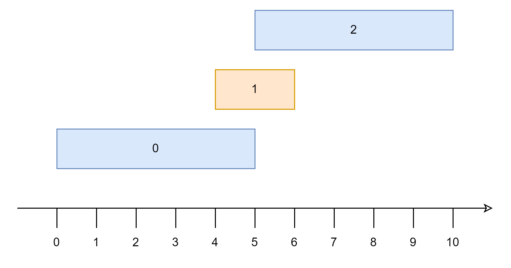

<!-- _class: lead -->

# Proving Greedy Algorithms
## Veteran Track
## Gabee De Vera

---

<!-- _class: top -->

# What is a Greedy Algorithm?

- A **greedy algorithm** is an algorithm that *makes the best choice* at every moment.
- While on the surface, greedy algorithms seem fine, we must be careful when using them since *the best decision at every moment may not be the best decision in the long run* ~~(wow, may pa-life lesson pa talaga tayo haha)~~

---

<!-- _class: top -->

# Examples of Greedy Algorithms

- Consider the **Knapsack Problem**: Given a set of objects $W$, the $i$th object having weight $w_i$, what is the largest number of objects your bag can hold if it can hold a total weight of at most $C$?

- Solution 1: Sort the objects by increasing weight, then keep picking the lightest object until you can't pick the next
- Does this work?

---

<!-- _class: top -->

# Examples of Greedy Algorithms

- Consider the **Knapsack Problem**: Given a set of objects $W$, the $i$th object having weight $w_i$, what is the largest number of objects your bag can hold if it can hold a total weight of at most $C$?

- Solution 1: Sort the objects by increasing weight, then keep picking the lightest object until you can't pick the next
- Does this work? **Yes! :smile:**
- We'll prove it later! :))

---

<!-- _class: top -->

# Examples of Greedy Algorithms

- Consider the **0-1 Knapsack Problem**: Given a set of objects $W$, the $i$th object having weight $w_i$ and value $v_i$, what is the maximum sum of values that you can achieve if your bag has a weight capacity of at most $C$? You can take multiple copies of an item.
- Solution 1: Keep taking the item with the largest value per weight $\frac{v_i}{w_i}$
- Does this work?

---

<!-- _class: top -->

# Examples of Greedy Algorithms

- Consider the **0-1 Knapsack Problem**: Given a set of objects $W$, the $i$th object having weight $w_i$ and value $v_i$, what is the maximum sum of values that you can achieve if your bag has a weight capacity of at most $C$? You can take multiple copies of an item.
- Solution 1: Keep taking the item with the largest value per weight $\frac{v_i}{w_i}$
- Does this work? **No, it does not :((**

---

<!-- _class: top -->

# Examples of Greedy Algorithms

- Consider the following set of items, with a backpack that can take a weight of at most $C = 8$

|$i$|$w_i$|$v_i$|
|--|--|--|
|0|2|4|
|1|7|15|

- The greedy algorithm would take one item of weight $7$ and be done, gaining a total value of $15$. However, the optimal allocation is to take $4$ copies of the item with weight $2$ for a total value of $16$.

---

<!-- _class: top -->

# Examples of Greedy Algorithms

- Consider the **Interval Scheduling Problem**: You have a set of lectures $L$, each with a specified start and end time $s_i$ and $e_i$. You need to schedule some of these lectures in one classroom. What is the maximum number of lectures that you can schedule?
- Solution 1: Repeatedly take the lecture with the shortest duration $e_i - s_i$, if it doesn't cause a conflict.
- Does this work?

---

<!-- _class: top -->

# Examples of Greedy Algorithms

- Consider the **Interval Scheduling Problem**: You have a set of lectures $L$, each with a specified start and end time $s_i$ and $e_i$. You need to schedule some of these lectures in one classroom. What is the maximum number of lectures that you can schedule?
- Solution 1: Repeatedly take the lecture with the shortest duration $e_i - s_i$, if it doesn't cause a conflict.
- Does this work? **No, it does not.** :cry:

---

<!-- _class: top -->

# Examples of Greedy Algorithms

- Consider the following set of lectures,

|$i$|$s_i$|$e_i$|
|--|--|--|
|0|0|5|
|1|4|6|
|2|5|10|

---

<!-- _class: top -->

# Examples of Greedy Algorithms

- In the previous slide, the algorithm would simply take the second lecture and terminate, since the second lecture is the shortest (this is shown in orange)
- However, the optimal solution is to take the first and third lectures (this is shown in blue)

---
<!-- _class: top -->

# Are Greedy Algorithms Bad?

- As you can see, there are many incorrect greedy algorithms. Does this mean that greedy algorithms are bad?

---
<!-- _class: top -->

# Are Greedy Algorithms Bad?

- As you can see, there are many incorrect greedy algorithms. Does this mean that greedy algorithms are bad? **No.**
- Greedy algorithms are bad when they are *unproven*.
- Most greedy algorithms operate on insights that must be justified through proof.
- So, let us **learn how to prove greedy algorithms**

---

<!-- _class: lead -->

# Proving Greedy Algorithms

---

<!-- _class: top -->
# Method 1: Exchange Argument

- By far the most common method of proving greedy algorithms is the **exchange argument**.
- The idea is to show how changing parts of an optimal solution with parts of the greedy solution does not worsen the solution.
- By showing this, you can continuously exchange parts of the optimal solution with the greedy solution. At some point, you will show that the greedy solution is not worse than the optimal solution, proving the correctness of the greedy algorithm.

---

<!-- _class: top -->
# Method 2: Greedy Stays Ahead

- With Greedy Stays Ahead, the idea is to show that, at each step, the *greedy choice is at least as good as the optimal solution's choice*, so therefore, the greedy algorithm is at least as good as the optimal solution's choice and is thus correct.

---

<!-- _class: top -->
# Method 3: Structural Arguments

- Structural Arguments use some structure or property of the problem or quantity being minimized to prove the correctness of a greedy algorithm.

---

<!-- _class: top -->
# Homework

- Read [this handout](https://redblazerflame.github.io/reboot-materials/compprog-materials/noiph-modules/algo2.pdf) on greedy algorithms by NOI.PH Trainer CJ Quines.
- Then, answer the homework in [the Reboot website](https://redblazerflame.github.io/reboot-materials/compprog-materials/veteran/6-greedy-1/) :smile:
- This week is proof-heavy, so feel free to ask for help in the Discord server, either from your fellow trainees or from the trainers.

---

<!-- _class: top -->

# References

- Quines, C. J. (n.d.). *NOI.PH training: Algorithms 2*. https://redblazerflame.github.io/reboot-materials/compprog-materials/noiph-modules/algo2.pdf