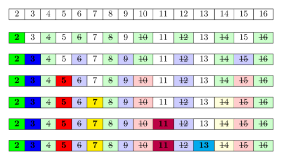

<style>
    @import "../../../slide.css";
</style>

<!-- _class: lead -->

# Number Theory 1
## Veteran Track
## Gabee De Vera

---

<!-- _class: top -->

# Guess the Next Term!

$4096, 8192, 16384, \_$

---

<!-- _class: top -->

# Guess the Next Term!

$4096, 8192, 16384, \mathbf{32768}$

- Powers of two!
- The next term is double the last ^^

---

<!-- _class: top -->

# Guess the Next Term!

$1, 1, 2, 3, 5, 8, 13, \_$

---

<!-- _class: top -->

# Guess the Next Term!

$1, 1, 2, 3, 5, 8, 13, \mathbf{21}$

- Fibonacci Numbers
- The next term is the sum of the past two terms

---

<!-- _class: top -->

# Guess the Next Term!

$1, 1, 1, 1, 2, 1, 1, 3, 3, 1, 1, 4, \_$

---

<!-- _class: top -->

# Guess the Next Term!

$1, 1, 1, 1, 2, 1, 1, 3, 3, 1, 1, 4, \mathbf{6}$

- It's Pascal's Triangle, but the entries have been flattened out
- Again, 

---

<!-- _class: top -->

# Guess the Next Term!

$1, 1, 2, 5, 14, \_$

---

<!-- _class: top -->

# Guess the Next Term!

$1, 1, 2, 5, 14, \mathbf{42}$

- It's the Catalan numbers!

---

<!-- _class: lead -->

# You've Seen these Sequences Before!

---

<!-- _class: lead -->

# Here are some new ones that you may or may not know ^^

---

<!-- _class: top -->

# Guess the Next Term!

$2, 3, 5, 7, 11, 13, 17, 19, \_$

---

<!-- _class: top -->

# Guess the Next Term!

$2, 3, 5, 7, 11, 13, 17, 19, \mathbf{23}$

- Yep! It's just the prime numbers! I'm sure you got this right ^^

---

<!-- _class: top -->

# Guess the Next Term!

$1, 1, 2, 2, 4, 2, 6, 4, 6, 4, \_$

---

<!-- _class: top -->

# Guess the Next Term!

$1, 1, 2, 2, 4, 2, 6, 4, 6, 4, \mathbf{10}$

- This one might be hard. These are the first few terms of **Euler's Totient Function**.
- The $n$th term (denoted $\varphi\left(n\right)$) is the number of numbers in the range $[1, n]$ that are coprime with $n$.
- For instance, the first term is $\varphi\left(1\right) = 1$ since $1$ is coprime with $1$.
- $\varphi(6) = 2$ since two numbers, namely $1$ and $5$, are coprime with $6$, but $2, 3, 4,$ and $6$ are not.
- $\varphi(11) = 10$ since $1, 2, 3, 4, 5, 6, 7, 8, 9,$ and $10$ are coprime with $11$, so the next term is $10$.

---

<!-- _class: top -->

# Guess the Next Term!

$1, -1, -1, 0, -1, 1, -1, \_$

- This one is difficult :eyes:

---

<!-- _class: top -->

# Guess the Next Term!

$1, -1, -1, 0, -1, 1, -1, \mathbf{0}$

- These are the first few terms of the **mobius function**.
- The $n$th term of the **mobius function**, denoted as $\mu\left(n\right)$, is defined as follows:
- Consider the **prime factorization of $n$**. If the number has a factor that is a perfect square, $\mu(n) = 0$. Otherwise, if $n$ has an odd number of prime factors, $\mu(n) = -1$. Finally, if $n$ has an even number of prime factors, $\mu(n) = 1$.

- For example, take $n = 30 = 2^1 \cdot 3^1 \cdot 5^1$. Since there are no primes with an exponent greater than one, and there are $3$ prime factors ($2$, $3$, and $5$), $\mu(30) = -1$.

---

<!-- _class: top -->

# Guess the Next Term!

$1, -1, -1, 0, -1, 1, -1, \mathbf{0}$

- Now, consider $n = 24 = 2^3 \cdot 3$. Since there are no primes with an exponent greater than one, and there are $2$ prime factors ($2$ and $3$), $\mu(24) = 1$.
- Finally, consider $n = 8 = 2^3$. Notice that the exponent of $2$ is greater than $1$. This means that there's a square that divides the number $8$. In this case, it's $2^2 = 4$. Therefore, $\mu(8) = 0$.

---

<!-- _class: top -->

# Recap
- To recap, we learned three new sequences/functions:
    1. The prime numbers
    1. Euler's totient function, $\varphi$
    1. The Mobius function, $\mu$

---

<!-- _class: top -->

# Prime Numbers and Prime Factorization
- A positive integer $p$ is prime if $p \ge 2$ and its only factors are $1$ and itself
- A number $n$ can be uniquely expressed as a product of primes (up to reordering the prime factors)
- For instance, $n = 360 = 2^3 \cdot 3^2 \cdot 5$. $2^3 \cdot 3^2 \cdot 5$ is known as the **prime factorization** of $360$
- The result that all numbers have a unique prime factorization is known as the **fundamental theorem of arithmetic**

---

<!-- _class: top -->

# Primality Checking

- How can we check if a number is prime?
- Well, all we need to do is to check whether its only factors are $1$ and itself, so something like this should work:

```c++
bool is_prime(int n) {
    for(int i = 2; i < n; i++) {
        if((n % i) == 0) return false;
    }
    return true;
}
```

- This works, and it gives a time complexity of $O(n)$. However, what if $n$ is big? Could we do better?

---

<!-- _class: top -->

# Primality Checking

- It turns out that we can! Let's say that $n$ has a factor $i$ that's not either $1$ or itself.
- Then, notice that $\frac{n}{i}$ is also another factor of $n$ that's not one or itself. Let $j = \frac{n}{i}$. Then, $ij = n$. In other words, $i$ and $j$ form a pair of factors.
- One thing you may know about factor pairs is that one of the numbers in the pair is always less than or equal to $\sqrt{n}$. An easy way to see this is that if $i, j \gt \sqrt{n}$, then $ij \gt n$, which is a contradiction.
- Therefore, it suffices to check the range $\left[1, \sqrt{n}\right]$ for factors, which gives us a $O(\sqrt{n})$ algorithm.

---

<!-- _class: top -->

# Primality Checking

- Here's the implementation of the $O(\sqrt{n})$ primality checker:

```c++
bool is_prime(int n) {
    for(int i = 2; i * i <= n; i++) {
        if((n % i) == 0) return false;
    }
    return true;
}
```

---

<!-- _class: top -->

# Primality Checking

- $\sqrt{N}$ is definitely fast, but what if we want to check whether a really large number (say around the size of $10^{18}$) is prime or not?

---

<!-- _class: top -->

# Primality Checking

- $\sqrt{N}$ is definitely fast, but what if we want to check whether a really large number (say around the size of $10^{18}$) is prime or not?
- This is where we can use randomized algorithms such as the **Fermat Primality Test**. Such algorithms can determine whether a number is prime or not really quickly (in $O(\log n)$ time), but come with the disadvantage that the algorithm is *probabilistic*, so there's a chance that it fails.
- Also, in CompProg, the Fermat Primality Test is often not used. I haven't ever had to use it yet in CompProg, but it's good to know it exists in case you need it.
- If you want to know more about the Fermat Primality Test, check this article: https://cp-algorithms.com/algebra/primality_tests.html#fermat-primality-test

---

<!-- _class: top -->

# Finding Primes in a Range

- Sometimes, we may need to find all prime numbers in the range $[1, N]$.
- We can use the previous primality checker to go through each number in the range and determine whether it is prime or not in $O(\sqrt{N})$ time. This gives an $O(N\sqrt{N})$ algorithm. Could we do better?

---

<!-- _class: top -->

# Finding Primes in a Range
- It turns out that we can do better!
- The idea is to **progressively filter out composite numbers in the range $[1, N]$**. Maintain an array of booleans $\text{isPrime}$. $\text{isPrime}\left[i\right]$ is true if and only if $i$ is prime.
- Initially, $\text{isPrime}$ is all true. Then, we will iterate along the range $i \in \left[2, N\right]$.
    - If $\text{isPrime}\left[i\right] = \text{true}$, then we will mark all multiples of $i$ (i.e., $2i$, $3i$, $4i$, etc... until $ki \le N$) as *not* prime.

---

<!-- _class: top -->

# Finding Primes in a Range


Source: https://cp-algorithms.com/algebra/sieve-of-eratosthenes.html

---

<!-- _class: top -->

# Finding Primes in a Range
- This method of filtering out the composite numbers is similar to *sieving* out the composite numbers, leaving only the prime numbers behind. This is why this method is known as the **Sieve of Eratosthenes**.
- What is the time complexity of this algorithm? In the worst case, it looks like we'll have to mark $O(N)$ numbers as not prime in each step, so naively, it seems like this algorithm takes $O(N^2)$ time! That seems slow! What now?

---

<!-- _class: top -->

# Finding Primes in a Range
- This method of filtering out the composite numbers is similar to *sieving* out the composite numbers, leaving only the prime numbers behind. This is why this method is known as the **Sieve of Eratosthenes**.
- What is the time complexity of this algorithm? In the worst case, it looks like we'll have to mark $O(N)$ numbers as not prime in each step, so naively, it seems like this algorithm takes $O(N^2)$ time! That seems slow! What now?
- The idea is that **$O(N^2)$** is not a *tight* bound of the time complexity. Let's try to compute it more accurately!

---

<!-- _class: top -->

# Finding Primes in a Range
- Again, the Sieve of Eratosthenes will iterate from $i \in \left[2, N\right]$. For each $i$, it will mark $O(\frac{N}{i})$ numbers as not prime.
- Summing this value over $i \in \left[2, N\right]$, we get $O(N \left(\frac{1}{2} + \frac{1}{3} + \frac{1}{4} + ... + \frac{1}{N}\right)) = O(N \sum_{i = 2}^{N} \frac{1}{i})$. Note that $\sum_{i = 2}^{N} \frac{1}{i} \lt \sum_{i = 1}^{N} \frac{1}{i} = H_N$, where $H_N$ is the $N$th harmonic number.
- A key fact about harmonic numbers is that $H_N = \sum_{i = 1}^{i} \frac{1}{N} = O(\log N)$. Therefore, the entire algorithm runs in $O(N \log N)$!

---

<!-- _class: top -->

# Finding Primes in a Range
- In fact, we can find an even tighter bound by considering that we only mark the multiples of $i$ as not prime if and only if $i$ itself is prime. Therefore, the time complexity of the algorithm is $O(N\sum_{p \le N, p \text{ is prime }} \frac{1}{p})$. By exploiting the distribution of the primes, we can show that the sieve of Eratosthenes runs in $O(N \log \log N)$ :exploding_head:

---

<!-- _class: top -->

# Sieve of Eratosthenes: Implementation

```c++
int n;
cin >> n;
vector<bool> is_prime(n + 1, true);
is_prime[0] = is_prime[1] = false;
for(int i = 2; i <= n; i++) {
    if(is_prime[i]) {
        for(int j = 2; j * i <= n; j++) is_prime[j * i] = false;
    }
}
```

---

<!-- _class: top -->

# A Different Sieve

- Challenge: the code below has been slightly modified. What do you think it does?

```c++
int n;
cin >> n;
vector<bool> is_something(n + 1, false);
is_something[0] = true;
for(int i = 1; i <= n; i++) {
    for(int j = 1; j * i <= n; j++) is_something[j * i] = !is_something[j * i];
}
```

---

<!-- _class: top -->

# A Different Sieve

- Challenge: the code below has been slightly modified. What do you think it does?

```c++
int n;
cin >> n;
vector<bool> is_something(n + 1, false);
is_something[0] = true;
for(int i = 1; i <= n; i++) {
    for(int j = 1; j * i <= n; j++) is_something[j * i] = !is_something[j * i];
}
```

- Yep! It **determines whether all numbers in the range $[1, N]$** are squares or not!
- In the code above, $\text{isSomething}\left[i\right]$ is true if and only if it has been flipped an odd number of times. This happens when $i$ has an odd number of factors.
- $i$ has an odd number of factors if and only if it's a perfect square!

---

<!-- _class: top -->

# Counting Divisors
- You can use sieves yet again to compute the number of divisors $\tau(i)$ of all numbers in the range $\left[1, N\right]$ in $O(N \log N)$.
- Start with $\tau\left[i\right] = 0$, then, for each number $i \in \left[1, N\right]$, increase $\tau\left[ki\right]$ by $1$.
```c++
int n;
cin >> n;
vector<int> num_div(n + 1, 0);
for(int i = 1; i <= n; i++) {
    for(int j = 1; j * i <= n; j++) num_div[j * i]++;
}
```

---

<!-- _class: top -->

# Euler's Totient Function

- Now, we will delve into computing Euler's Totient Function.
- Recall that $\varphi\left(n\right)$ is the number of numbers in the range $\left[1, n\right]$ that are coprime with $n$.
- We can use **sieves** to compute $\varphi$ over $\left[1, N\right]$ in $O(N \log \log N)$.

- To do this, we will exploit the following property. Given the prime factorization of $n$, $n = \prod_{i} {p_i}^{q_i}$, where $p_i$ is the $i$th prime, we can compute $\varphi(n)$ as follows:

$$\phi\left(n\right) = \phi\left(\prod_{i} {p_i}^{q_i}\right) = \prod_{i} {p_i}^{q_i - 1} \cdot \varphi(p_i) = \prod_{i} {p_i}^{q_i - 1} \cdot \left(p_i - 1\right)$$

---

<!-- _class: top -->

# Euler's Totient Function

$$\phi\left(n\right) = \prod_{i} {p_i}^{q_i - 1} \cdot \left(p_i - 1\right) = \prod_{i} {p_i}^{q_i} \cdot \left(1 - \frac{1}{p_i}\right) = \prod_{i} {p_i}^{q_i} \cdot \prod_{i} \left(1 - \frac{1}{p_i}\right) = n \prod_{i} \left(1 - \frac{1}{p_i}\right)$$

- In other words, we can obtain $\varphi\left(n\right)$ by adjusting $n$ by a "correction factor" for each of its prime divisors. The "correction factor" involves multiplying $n$ by $1 - \frac{1}{p}$ for each prime divisor.
- Equivalently, we can set $\varphi\left[n\right] \leftarrow \varphi\left[n\right] - \frac{\varphi\left[n\right]}{p}$ for each of its prime divisors. Thus, doing something like `phi[n] -= phi[n]/p` for each prime $p$ dividing $n$ works.
- We can set $\varphi\left[i\right] = i$ initially. Then, to detect when a number is prime, it suffices to check whether $\varphi\left[i\right] = i$ the moment we iterate over it (since this implies that no other prime factors have adjusted its value, implying that it has *no other prime factors* and thus is prime). 

---

<!-- _class: top -->

# Euler's Totient Function: Implementation
- The time complexity of this implementation is $O(n \log \log n)$. It is based on the implementation in https://cp-algorithms.com/algebra/phi-function.html#etf_1_to_n

```c++
ll n;
cin >> n;
vector<ll> phi(n + 1, 0ll);
for(ll i = 0; i <= n; i++) {
    phi[i] = i;
}
for(ll i = 2ll; i <= n; i++) {
    if(phi[i] == i) {
        for(ll j = 1ll; i * j <= n; j++) {
            phi[i * j] -= phi[i * j] / i;
        }
    }
}
```

---

<!-- _class: top -->

# Euler's Totient Function: Applications

- Euler's Totient Function can be used to **compute power towers**. In particular, we have the following generalization of **Fermat's Little Theorem**:
$$a^n \equiv a^{n \mod \varphi(m)} \mod m$$
- One can use this to compute power towers quickly! For instance, try finding:
$$2023^{2022^{2021^{2020^{\cdots}}}} \mod 24$$

---

<!-- _class: top -->

# Mobius Function

- Finally, we get to the **Mobius Function**. The mobius function (denoted as $\mu$), is an important number-theoretic function, as we will see in a while.
- It is defined as:

$$\mu\left(n\right) = \begin{cases}0\text{ if }n\text{ has a perfect square as a factor}\\ 1\text{ if }n\text{ has no perfect square factors and has an even number of prime factors }\\ -1\text{ if }n\text{ has no perfect square factors and has an odd number of prime factors }\end{cases}$$

- Though this function may seem arbitrary, it has a lot of applications in number theory.

---

<!-- _class: top -->

# Mobius Inversion
- Note the following identity related to Euler's Totient Function:

$$n = \sum_{d|n} \varphi\left(d\right)$$

- It turns out that there's a corresponding "shadow" identity related to the one above,

$$\varphi(n) = \sum_{d|n} \mu(d) \cdot \frac{n}{d}$$

- In a sense, the new identity is somehow an "inverse" of the previous one, since we've taken out the totient function from the summation

---

<!-- _class: top -->

# Mobius Inversion

- In fact, suppose $f$ and $g$ are functions over the positive integers. Then, if $f$ and $g$ are related as follows,

$$f(n) = \sum_{d|n} g\left(d\right)$$

- We have a corresponding inverse relationship between $f$ and $g$,

$$g(n) = \sum_{d|n} \mu(d) f\left(\frac{n}{d}\right)$$

- This is known as the **Mobius Inversion Formula**. It is one of the most powerful applications of the Mobius function.

---

<!-- _class: top -->

# Calculating the Mobius Function

$$\mu\left(n\right) = \begin{cases}0\text{ if }n\text{ has a perfect square as a factor}\\ 1\text{ if }n\text{ has no perfect square factors and has an even number of prime factors }\\ -1\text{ if }n\text{ has no perfect square factors and has an odd number of prime factors }\end{cases}$$

- Calculating the $n$th term of the Mobius function can be done with a sieve as well; however, it is not as simple as the other applications of the sieve technique.
- Writing a program to compute the Mobius function will be left to you as an exercise! ^^
- To help guide you, here are some things that will help you compute $\mu$:
    1. You need to know how many prime factors a number $n$ has
    1. Then, you must determine whether or not a number is squarefree (i.e., has no perfect squre factors)

---

<!-- _class: top lead -->

# Takeaway

<br>
<br>
<br>

## Sieve Methods are POWERFUL

---

<!-- _class: top -->

# Homework

- Check the [Reboot Website](https://redblazerflame.github.io/reboot-materials/compprog-materials/veteran/9-number-theory/) for the homework this week. The homework problems for this week may be challenging, so feel free to **collaborate and discuss with your fellow trainees**. You may also **ask for help from the trainers** and even **read the editorial (but only when you're really stuck)** :smile:

---

<!-- _class: top -->

# References

1. *Euler's totient function*. (2024, January 27). CP-Algorithms. https://cp-algorithms.com/algebra/phi-function.html


---

<!-- _class: lead -->

# Appendix

---

<!-- _class: top -->

# Euler's Totient Function: Additional Properties
- Here are some properties of Euler's Totient Function that may help. These are mostly useful in more mathematical settings, but it's good to know these properties exist ^^

$$\varphi(mn) = \varphi(m) \cdot \varphi(n)\text{, where }m \text{ and } n \text{ are coprime}$$

- A more general version of the multiplicative rule:
$$\varphi(mn) = \varphi(m) \cdot \varphi(n) \cdot \frac{\text{gcd}(m, n)}{\varphi(\text{gcd}(m, n))}$$

$$\varphi(n^k) = \varphi(n) \cdot n^{k - 1}$$